cmd.exe窗口命令行新建文件夹

```
mkdir projectName
```

#### 冒泡时间与默认事件

阻止冒泡

```
window.event? window.event.cancelBubble = true : e.stopPropagation();
```

cancelBubble是ie浏览器阻止冒泡的代码

取消默认事件

```
w3c的方法是e.preventDefault()，IE则是使用e.returnValue = false
```

事件冒泡

IE 的事件流叫做事件冒泡（event bubbling），即事件开始时由最具体的元素（文档中嵌套层次最深 的那个节点）接收，然后逐级向上传播到较为不具体的节点（文档）。

#### 获取元素宽度

在 [JavaScript](http://c.biancheng.net/js/) 中，使用下面 3 组属性可以获取元素的高度和宽度。如表所示。

| 元素尺寸属性 | 说明                                                    |
| ------------ | ------------------------------------------------------------ |
| clientWidth  | 获取元素可视部分的宽度，即 CSS 的 width 和 padding 属性值之和，元素边框和滚动条不包括在内，也不包含任何可能的滚动区域 |
| clientHeight | 获取元素可视部分的高度，即 CSS 的 height 和 padding 属性值之和，元素边框和滚动条不包括在内，也不包含任何可能的滚动区域 |
| offsetWidth  | 元素在页面中占据的宽度总和，包括 width、padding、border 以及滚动条的宽度 |
| offsetHeight | 元素在页面中占据的高度总和，包括 height、padding、border 以及滚动条的宽度 |
| scrollWidth  | 当元素设置了 overflow:visible 样式属性时，元素的总宽度，也称滚动宽度。在默认状态下，如果该属性值大于 clientWidth 属性值，则元素会显示滚动条，以便能够翻阅被隐藏的区域 |
| scrollHeight | 当元素设置了 overflow:visible 样式属性时，元素的总高度，也称滚动高度。在默认状态下，如果该属性值大于 clientWidth 属性值，则元素会显示滚动条，以便能够翻阅被隐藏的区域 |

#### 


## react使用及笔记

#### 1. 安装及使用

##### 1.1 sass安装

1.安装：

```
npm install sass-loader node-sass --save-dev
```

2.找到node_modules/react-scripts/config/webpack.config.dev.js

添加如下代码：

```
oneOf: [
    // 添加部分
    {
        test:/\.scss$/,
        loaders: ['style-loader', 'css-loader', 'sass-loader']
    },
    // 添加部分
    {
    	test: [/\.avif$/],
    ...
]
```


#### 2. 常见语法及使用

##### 2.1 

##### 2.2 


#### 3. 常见问题

##### 3.1 使用scss时报错:this.getOptions is not a function

问题： 在进行 `react` 项目开发的时候，出现了这个错误，`TypeError: this.getOptions is not a function`

如下：

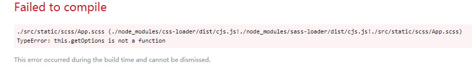

原因：`sass-loader` 的版本过高，不兼容 `getOptions` 函数方法，所以需要对 `sass-loader` 进行降级处理

解决：

卸载之前的版本

```
npm uninstall sass-loader
```

安装新版本

```
npm install sass-loader@6.0.6
```

##### 3.2 Using target="_blank" without rel="noopener noreferrer" is a security risk

```
a标签上面添加 rel="noopener noreferrer" 即可
```

##### 3.3 Error: Redirected when going from "/login" to "/home" via a navigation guard

这个是一级路由跳转二级路由的问题,解决方法：

```
// 解决ElementUI导航栏中的vue-router在3.0版本以上重复点菜单报错问题
const originalPush = Router.prototype.push
Router.prototype.push = function push (location) {
  return originalPush.call(this, location).catch(err => err)
}
```


## markdown基本使用

```方框
```描述语  方框
```

`重点词汇`（用`包裹）

~~~标题类
# 标题类  1-6个
~~~

4 < 5

&copy;

*我是强调*

```
``There is a literal backtick (`) here.``
```

``这是`强调君``

* / * /号表示

  ### 字体

  - ##### 加粗

  要加粗的文字左右分别用两个*号包起来

  - ##### 斜体

  要倾斜的文字左右分别用一个*号包起来

  - ##### 斜体加粗

  要倾斜和加粗的文字左右分别用三个*号包起来

  - ##### 删除线

  要加删除线的文字左右分别用两个~~号包起来

  示例：

  ```
  **这是加粗的文字**
  *这是倾斜的文字*
  ***这是斜体加粗的文字***
  ~~这是加删除线的文字~~
  ```
效果：

**这是加粗的文字** 

*这是倾斜的文字* 

**这是斜体加粗的文字** 

~~这是加删除线的文字~~ 

### 引用

在引用的文字前加>即可。引用也可以嵌套，如加两个>>三个>>> 

示例：

```
>这是引用的内容
>>这是引用的内容
>>>>>>>>>>这是引用的内容
```

效果如下：

> 引用

### 分割线

三个或者三个以上的 - 或者 *或者_ 都可以。

示例：

```
---
----
***
*****
```

效果如下：

---

***

___

### 列表

用* 或者-或者+

效果：

* 无序列表

  - 无序列表

    * 无序列表
      + 无序列表


### 链接/图片

```
使用方法:
[链接某一个网页](超链接地址 "超链接title")
```

实现效果：

[我是百度君](http://baidu.com)

图片：

```
方式1:  直接拖拽入markdown中
方式2:
```

效果：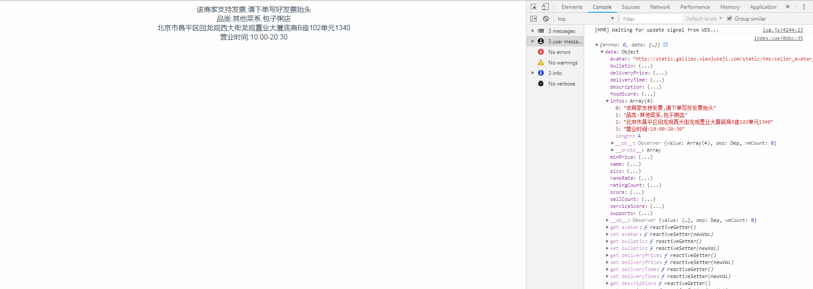

## 浏览器内核

浏览器内核是浏览器的核心，也称“渲染引擎”，用来解释网页语法并渲染到网页上 

Trident(IE内核) 

[IE6](https://baike.baidu.com/item/IE6)、[IE7](https://baike.baidu.com/item/IE7)、[IE8](https://baike.baidu.com/item/IE8)（Trident 4.0）、[IE9](https://baike.baidu.com/item/IE9)（Trident 5.0）、IE10（Trident 6.0）、360安全浏览器（1.0-5.0为Trident，6.0为Trident+Webkit，7.0为Trident+Blink）、[猎豹极轻浏览器](https://baike.baidu.com/item/%E7%8C%8E%E8%B1%B9%E6%9E%81%E8%BD%BB%E6%B5%8F%E8%A7%88%E5%99%A8)，[360极速浏览器](https://baike.baidu.com/item/360%E6%9E%81%E9%80%9F%E6%B5%8F%E8%A7%88%E5%99%A8)（7.5之前为Trident+Webkit，7.5为Trident+Blink）[猎豹安全浏览器](https://baike.baidu.com/item/%E7%8C%8E%E8%B1%B9%E5%AE%89%E5%85%A8%E6%B5%8F%E8%A7%88%E5%99%A8)（1.0-4.2版本为Trident+Webkit，4.3及以后版本为Trident+Blink）[猎豹极轻浏览器](https://baike.baidu.com/item/%E7%8C%8E%E8%B1%B9%E6%9E%81%E8%BD%BB%E6%B5%8F%E8%A7%88%E5%99%A8)，傲游浏览器（傲游1.x、2.x为[IE](https://baike.baidu.com/item/IE)内核，3.x为IE与[Webkit](https://baike.baidu.com/item/Webkit)双核）、[百度浏览器](https://baike.baidu.com/item/%E7%99%BE%E5%BA%A6%E6%B5%8F%E8%A7%88%E5%99%A8)（早期版本）、[世界之窗浏览器](https://baike.baidu.com/item/%E4%B8%96%E7%95%8C%E4%B9%8B%E7%AA%97%E6%B5%8F%E8%A7%88%E5%99%A8) [2]  （最初为IE内核，2013年采用Chrome+IE内核）、2345浏览器、[腾讯TT](https://baike.baidu.com/item/%E8%85%BE%E8%AE%AFTT)、[淘宝浏览器](https://baike.baidu.com/item/%E6%B7%98%E5%AE%9D%E6%B5%8F%E8%A7%88%E5%99%A8)、[采编读浏览器](https://baike.baidu.com/item/%E9%87%87%E7%BC%96%E8%AF%BB%E6%B5%8F%E8%A7%88%E5%99%A8)、[搜狗高速浏览器](https://baike.baidu.com/item/%E6%90%9C%E7%8B%97%E9%AB%98%E9%80%9F%E6%B5%8F%E8%A7%88%E5%99%A8)（1.x为Trident，2.0及以后版本为Trident+Webkit）、阿云浏览器（早期版本） 

Gecko(Firefox内核) 

[Mozilla Firefox](https://baike.baidu.com/item/Mozilla%20Firefox)、Mozilla SeaMonkey、waterfox（Firefox的64位开源版）、Iceweasel、Epiphany（早期版本）、Flock（早期版本）、K-Meleon 

Presto(Opera前内核) （已废弃）

Webkit

它是苹果公司自己的内核，也是苹果的[Safari](https://baike.baidu.com/item/Safari)浏览器使用的内核 

Google Chrome、[360极速浏览器](https://baike.baidu.com/item/360%E6%9E%81%E9%80%9F%E6%B5%8F%E8%A7%88%E5%99%A8)以及[搜狗高速浏览器](https://baike.baidu.com/item/%E6%90%9C%E7%8B%97%E9%AB%98%E9%80%9F%E6%B5%8F%E8%A7%88%E5%99%A8)高速模式也使用Webkit作为内核(在脚本理解方面，Chrome使用自己研发的V8引擎)。WebKit 内核在手机上的应用也十分广泛，例如 Google 的手机 Gphone、 Apple 的iPhone， Nokia’s Series 60 browser 等所使用的 Browser 内核引擎，都是基于 WebKit。

WebKit内核常见的浏览器：傲游浏览器3、 [1][Apple Safari](https://baike.baidu.com/item/Apple%20Safari) (Win/Mac/iPhone/iPad)、Symbian手机浏览器、Android 默认浏览器

总结：

1、IE浏览器内核：Trident内核，也是俗称的IE内核；
2、Chrome浏览器内核：统称为Chromium内核或Chrome内核，以前是Webkit内核，现在是Blink内核；
3、Firefox浏览器内核：Gecko内核，俗称Firefox内核；
4、Safari浏览器内核：Webkit内核；
5、Opera浏览器内核：最初是自己的Presto内核，后来是Webkit，现在是Blink内核；
6、360浏览器、猎豹浏览器内核：IE+Chrome双内核；
7、搜狗、遨游、QQ浏览器内核：Trident（兼容模式）+Webkit（高速模式）；
8、百度浏览器、世界之窗内核：IE内核；
9、2345浏览器内核：以前是IE内核，现在也是IE+Chrome双内核；

## 1.正则

数字转逗号隔开

```
parseFloat(nodeNum).toLocaleString()
```

银行卡正则

```
 /^([1-9]{1})(\d{12,18})$/ 
```

手机校验

```
/^1(3|4|5|6|7|8|9)\d{9}$/
or
/^13|4|5|7|8\d{8}$/
or
/^1[3|4|5|7|8][0-9]\d{8}$/
or
/^1[3|4|5|6|7|8|9][0-9]{9}$/ (百度)
```

座机正则

```
/^0\d{2,3}-\d{7,8}$/
```

座机或者手机号

```
/^(0\d{2,3}-\d{7,8})|(1[3|4|5|7|8][0-9]\d{8})$/
```
小于100的数字，且保留小数点后2位数

```
/^((\d|[1-9]\d)(\.\d{1,2})?)$/
```

信用卡号

```
/\d{15}|\d{19}/
```

特殊字符正则

```
/[~!@#$%^&()_-+=<>?:"{}|,.\/;'[]·~！@#￥%……&（）——-+={}|《》？：“”【】、；‘’，。、]`/(通过测试)
```

字母和数字

```
/^[a-zA-Z\d]+$/
```

最少6位，大小写字母、数字、特殊字符的组合

```
/(?=.[0-9])(?=.[a-zA-Z])(?=.* (a-zA-Z0-9)).{6,30}/ （Bug）
```

邮箱

```
/^([a-zA-Z0-9-])+@([a-zA-Z0-9-])+((.[a-zA-Z0-9_-]{2,3}){1,2})$/
or
/^([a-zA-Z0-9._-])+@([a-zA-Z0-9_-])+((.[a-zA-Z0-9_-]{2,3}){1,2})$/ （伙伴用）
or
/^([a-zA-Z]|[0-9])(\w|-)+@[a-zA-Z0-9]+.([a-zA-Z]{2,4})$/g （有用）
or
/^[A-Za-z0-9\u4e00-\u9fa5]+@[a-zA-Z0-9_-]+(\.[a-zA-Z0-9_-]+)+$/ （案管用）
or

/^([A-Za-z0-9_\-\.])+\@([A-Za-z0-9_\-\.])+\.([A-Za-z]{2,4})$/ （百度）
数字
/^[0-9]+\.{0,1}[0-9]{0,2}$/ （百度用）
```

大小写字母、数字和下划线并用逗号隔开

```
/^[0-9a-zA-Z_\,]{1,}$/ （常用）
```

url地址

```
/^http[s]?:\/\/.*/
or
/[-a-zA-Z0-9@:%._\\+~#=]{2,256}\.[a-z]{2,6}\b([-a-zA-Z0-9@:%_\\+.~#?&//=]*)/ （百度用）
```

大小写、数字、特殊字符中至少两种组合

```
^(?![A-Z]+$)(?![a-z]+$)(?!\d+$)(?![\W_]+$)\S+$
```

6-20位小写、数字、特殊字符中至少两种组合

```
^(?![\d]+$)(?![a-zA-Z]+$)(?! (\da-zA-Z)+$).{6,20}$
/(?=.*[0-9])(?=.*[a-zA-Z])(?=.*[^a-zA-Z0-9]).{6,30}/  大小写字母、数字、特殊字符的组合（智审，最早）
```

大写字母、汉字和数字

```
^[\u4E00-\u9FA5A-Z0-9]+$
```

未知

```
/^1-9{5}(1[0-9]{2}|20|1)(0|1)(0|1|2|3)[0-9]{3}([0-9]|[X])$/g
```

账号必须字母开头，若有数字则必须以下划线分割

```
/^[a-zA-Z]([a-z_A-Z](_[0-9]+){0,})*$/ （通过测试）
```

同时包含数字、大小写字母和特殊字符四种组合，特殊组合仅限于（~@#￥%^&*_-+=:,.?[]{}）

```
/^(?=.*\d)(?=.*[a-z])(?=.*[A-Z])(?=.*[~@#$%^&\*-\+=:,.\\?\[\]\{}]).{6,16}$/ （通过测试）
```

同时包含数字、大小写字母和特殊字符三种

```
/^(?=.*\d)(?=.*[a-zA-Z])(?=.*[~@#$%^&\*-\+=:,.\\?\[\]\{}]).{6,16}$/  （通过测试）
```

社会统一社会代码

```
/^ (_IOZSVa-z\W){2}\d{6} (_IOZSVa-z\W){10}$/g
```

小数点后两位小数

```
/^[0-9]+(.[0-9]{1,3})?$/
小于等于100
/(^(\d|[1-9]\d)(\.\d{1,2})?$)|(^100$)/
```

1-8位的数字，且可保留小数点后2位数

```
/^1-9{0,7}(.{0,2})?$/
```

0-100及可保留小数点后两位小数，不能100.00这样

```
/^(100)$|^((\d|[1-9]\d)(.\d{1,2})?)$/
```

校验身份证格式

```
/^[1-9][0-9]{5}([1][9][0-9]{2}|[2][0][0|1][0-9])([0][1-9]|[1][0|1|2])([0][1-9]|[1|2][0-9]|[3][0|1])[0-9]{3}([0-9]|[X])$/g
```

```
var validatecardId = (rule, idcode, callback) => {
      var weight_factor = [7, 9, 10, 5, 8, 4, 2, 1, 6, 3, 7, 9, 10, 5, 8, 4, 2];
      
      // 校验码
      var check_code = ['1', '0', 'X', '9', '8', '7', '6', '5', '4', '3', '2'];
      var code = idcode + '';
      var last = idcode[17];// 最后一个
      var seventeen = code.substring(0, 17);
      
      // ISO 7064:1983.MOD 11-2
      // 判断最后一位校验码是否正确
      var arr = seventeen.split('');
      var len = arr.length;
      var num = 0;
      for (var i = 0; i < len; i++) {
        num = num + arr[i] * weight_factor[i];
      }

      // 获取余数
      var resisue = num % 11;
      var last_no = check_code[resisue];

      // 格式的正则
      // 正则思路
      /*
      第一位不可能是0
      第二位到第六位可以是0-9
      第七位到第十位是年份，所以七八位为19或者20
      十一位和十二位是月份，这两位是01-12之间的数值
      十三位和十四位是日期，是从01-31之间的数值
      十五，十六，十七都是数字0-9
      十八位可能是数字0-9，也可能是X
      */

      // 身份证格式
      var idcard_patter = /^1-9{5}(1[0-9]{2}|20|1)(0|1)(0|1|2|3)[0-9]{3}([0-9]|[X])$/;
      // 护照格式
      var idforeign_patter = /^145{7}$|([P|p|S|s]\d{7}$)|([S|s|G|g|E|e]\d{8}$)|([Gg|Tt|Ss|Ll|Qq|Dd|Aa|Ff]\d{8}$)|([H|h|M|m]\d{8,10})$/;
      // 港澳通行证
      var idhongkong_patter = /^([A-Z]\d{6,10}(\w1)?)$/;

      // 判断格式是否正确
      var format = idcard_patter.test(idcode);

      // 返回验证结果，校验码和格式同时正确才算是合法的身份证号码
      // return last === last_no && format ? true : false;
      if ((last === last_no && format) || idforeign_patter.test(idcode) || idhongkong_patter.test(idcode)) {
        callback()
      } else {
        callback(new Error('请输入正确的证件号码'))
      }
    }

```

判断性别

```
if (num.length == 15) {
    let type = num.substring(14);
    if (type / 2 == parseInt(type / 2)) {
        this.departData.sex = 2;
    } else {
        this.departData.sex = 1;
    }
} else if (num.length == 18) {
    let type = num.substring(16, 17);
    if (type / 2 == parseInt(type / 2)) {
    	this.departData.sex = 2;
    } else {
    	this.departData.sex = 1;
    }
}
```

17位数字

```
/^\d{17}$/
```

```
urlStr.replace(/[\s]+/g, '+')
空格转+，不然转义解析会报错
```


#### 判断操作系统

```
let u = navigator.userAgent
if (u.indexOf('Android') > -1 || u.indexOf('Adr') > -1) {
  window.android.closePage(this.contractInfo.contractNo);
}
if (u.match(/\(i[^;]+;( U;)? CPU.+Mac OS X/)) {
  window.webkit.messageHandlers.closePage.postMessage(this.contractInfo.contractNo);
}
```

#### 编码和解码内容

```
encodeURIComponent
```

#### 切换

```
function tabs(tabTit, on, tabCon) {
    $(tabCon).each(function () {
        $(this).children().eq(0).show();
    });
    $(tabTit).each(function () {
        $(this).children().eq(0).addClass(on);
    });
    $(tabTit).children().click(function () {
        $(this).addClass(on).siblings().removeClass(on);
        var index = $(tabTit).children().index(this);
        $(tabCon).children().eq(index).show().siblings().hide();
    });
}
tabs(".ul-1", "current", ".ul-2")
```

#### 映射

```
1. return {
	'1': '自然人',
    '2': '法人'
} [this.user.identity]
or
2. let map = {
    1: '自然人',
    2: '法人'
}
return map[val] ? map[val] : '未知'
```

#### 滑动条距离

```
window.pageYOffset
```

#### 窗口宽高

在IE、Firefox、Safari、Opera和Chrome中，document.documentElement.clientWidth和document.documentElement.clientHeight中保存了页面视口的信息。在IE6中，这些属性必须在标准模式下才有效；如果是混杂模式，就必须通过document.body.clientWidth和document.body.clientHeight取的相同的信息。对于Chrome下，两种都行

```
var pageWidth = window.innerWidth,
    pageHeight = window.innerHeight;
            
if (typeof pageWidth != "number"){
    if (document.compatMode == "CSS1Compat"){
        pageWidth = document.documentElement.clientWidth;
        pageHeight = document.documentElement.clientHeight;
    } else {
        pageWidth = document.body.clientWidth;
        pageHeight = document.body.clientHeight;
    }
}
```


## 2.工作中遇到的问题解决

#### 2.1 vue异步调用造成的element-ui组件中的message显示问题 

1.重新构建message组件resetMessage

element-ui是动态往页面根节点插入message元素来实现弹框效果的，所以
/**重置message，防止重复点击重复弹出message弹框 */

```
import {Message} from 'element-ui';
let messageInstance = null;
const resetMessage = (options) => {
    if(messageInstance) {
    	messageInstance.close()
    }
    messageInstance = Message(options)
};

['error','success','info','warning'].forEach(type => {
    resetMessage[type] = options => {
        if(typeof options === 'string') {
            options = {
            message:options
        	}
    	}
        options.type = type
        return resetMessage(options)
    }
})

export const message = resetMessage
```

2.在main.js中引用重新构造的message组件

```

import {message} from '@/utils/resetMessage';

Vue.use(ElementUI)

Vue.prototype.$message = message;

```

注意：挂载自定义message必须放在Vue.use(ElementUI)后面，才能覆盖element-ui默认的message，不然没有效果

```

              this.$message({
                message: '提交审核成功！',
                type: 'success',
                duration: 1000,
                onClose: () => {
                  this.getDataList()
                  this.verifyDialog = false
                  this.btnFlag = false
                }
              })s
```


#### 2.2 支付宝支付跳转 

后端返回的是数据是 

```
<form name="punchout_form" method="post" action="https://openapi.alipaydev.com/gateway.do?charset=UTF-8&method=alipay.trade.page.pay&sign=UhEZFT%2FyN%2BZz11KZTLmPL9GmjA8ZHtYcjGJzXP%2BBuUl%2FJo4fMpf5Ss6qXdKkK3PxuW8ZOGUF75gJxcf4rqk7ZM356Wos8dWzdaEJokosBkaCPOtxsr4Y7ajlxAoRcgjYH7Lv8tix8hIydby6qfKySL2Zz1ll0d6F5Jk1xIWRe445Um1d%2BYK6pbN9q375%2BXd3jP%2BFJvcxhLTk13T8wSmOZI8GKUMYzfHmGY%2FTwq3D9FKKVXaLIYJCUQZAwSvo4upMq0OEtzGvAUOkbCWVnCSdeXZb7xZKTQxjdYalQ1e6hjuV%2F49HuxgRN1mgRnEzuMe1wp9eYWF1R%2BIioWr6iR2yvw%3D%3D&version=1.0&app_id=2016101800713295&sign_type=RSA2×tamp=2020-03-20+16%3A17%3A43&alipay_sdk=alipay-sdk-java-3.1.0&format=json"> <input type="hidden" name="biz_content" value="{"body":"具体订单的描述===可修改","out_trade_no":"TON2020032000052","product_code":"FAST_INSTANT_TRADE_PAY","subject":"安存案件仲裁费的订单名称===可修改","timeout_express":"10m","total_amount":"10000"}"> <input type="submit" value="立即支付" style="display:none" > </form> <script>document.forms[0].submit();</script>
```

不稳定（safrai页面会拦截）

```
let divForm = document.getElementsByClassName('recharge')
if (divForm.length) {
document.body.removeChild(divForm[0])
}
const div = document.createElement('div');
div.setAttribute('class', 'recharge')
div.innerHTML = data.payPage;
document.body.appendChild(div);
document.forms[0].setAttribute('target','_blank')
document.forms[0].submit();

var newwindow = window.open('#', '_blank');
 newwindow.document.write(data.payPage);
```

稳定版本

1. 操作

```
let newpage = this.$router.resolve({
            name: 'chargeInfo',
            query: {i: encodeURIComponent(JSON.stringify(this.params))}
          })
          window.open(newpage.href, '_blank')
```

2. 处理页面

```
<template>
  <div>
    <div style="padding: 30px">前往支付中，请稍后...</div>
    <div v-html="alipayWap" ref="alipayWap" style="display: none"></div>
  </div>
</template>

<script>
export default {
  data () {
    return {
      alipayWap: '',
      params: {}
    }
  },
  created () {
    this.params = JSON.parse(decodeURIComponent(this.$route.query.i))
    this.$http({
      url: this.$http.adornUrl('/arbitration/apipay/initiatePayment'),
      method: 'post',
      data: this.$http.adornParams(this.params)
    }).then(({data}) => {
      if (data && data.code === 0) {
        localStorage.setItem('order', data.orderNum)
        this.alipayWap = data.payPage
        this.$nextTick(() => {
          this.$refs.alipayWap.children[0].submit()
        })
      } else {
        this.$message.warning(data.msg)
      }
    })
  },
  methods: {
  }
}
</script>

<style lang="scss" scoped>
</style>

```

#### 2.4下载预览文件

```
downloadContract({contractId, partnerId}).then(res => {
        var str = res.headers['content-disposition']
        var blob = new Blob([res.data], {type: res.headers['content-type']+';charset=UTF-8'})
        console.log(res.headers['content-type']+';charset=UTF-8')
        downFile(blob, str.split('=')[1])
      })
```

```
export function downFile (blob, fileName) {
  if (window.navigator.msSaveOrOpenBlob) {
    navigator.msSaveBlob(blob, decodeURI(fileName))
  } else {
    var link = document.createElement('a')
    link.href = URL.createObjectURL(blob)
    link.download = decodeURI(fileName)
    document.body.appendChild(link)
    link.click()
  }
}
```

```
let blob = new Blob([res], { type: 'application/pdf;charset=UTF-8' });
        let link = document.createElement('a');
        link.href = URL.createObjectURL(blob);
        link.target = '_blank';
        document.body.appendChild(link);
        window.open(link);
```

 4.上传文件

```
let param = new FormData(); // 创建form对象
      param.append('batchType', this.batchType)
      param.append('file', this.caseFile); // 通过append向form对象添加数据
      this.$http.post(this.$http.adornUrl('/arbitration/casebaseinfo/batchImportExcelCase'), param, {headers: {'Content-Type': 'multipart/form-data'}}).then(
      ({data}) => {
})
```

 

#### 2.5.vue使用粒子背景的插件是 vue-particles

#### 2.6.时间组件配置

```
dateRangePickerOptions: {
        shortcuts: [{
          text: '最近一天',
          onClick(picker) {
            const end = new Date();
            const start = new Date();
            start.setTime(start.setDate(start.getDate() - 1));
            picker.$emit('pick', [start, end]);
          }
        }, {
          text: '最近一周',
          onClick(picker) {
            const end = new Date();
            const start = new Date();
            start.setTime(start.setDate(start.getDate() - 7));
            picker.$emit('pick', [start, end]);
          }
        }, {
          text: '最近一个月',
          onClick(picker) {
            const end = new Date();
            const start = new Date();
            start.setTime(start.setMonth(start.getMonth() - 1));
            picker.$emit('pick', [start, end]);
          }
        }, {
          text: '最近三个月',
          onClick(picker) {
            const end = new Date();
            const start = new Date();
            start.setTime(start.setMonth(start.getMonth() - 3));
            picker.$emit('pick', [start, end]);
          }
        }]
      },
```

时间短选择：

```
pickerOptions: {
    disabledDate (date) {
    	date.getTime() < Date.now() - 7 * 24 * 3600 * 1000 || date.getTime() > Date.now();
    }
}
or

day: '2021-06-09',
pickerOptions: {
    disabledDate (date) {
        let startDate= vue.day.replace(new RegExp('-', 'gm'), '/');
        let time = (new Date(startDate)).getTime();
        return date.getTime() < time || date.getTime() > Date.now();
    }
}
```

 效果如下：

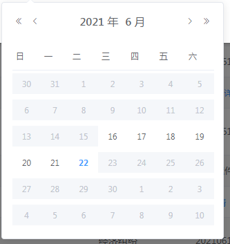

7.base64转blob 不兼容IE

```
base64ToBlob (code) {
      let parts = code.split(';base64,');
      let contentType = parts[0].split(':')[1];
      let raw = window.atob(parts[1]);
      let rawLength = raw.length;
      let uInt8Array = new Uint8Array(rawLength);
      for (let i = 0; i < rawLength; ++i) {
        uInt8Array[i] = raw.charCodeAt(i);
      }
      return new Blob([uInt8Array], {type: contentType});
    },
```

#### 2.7.el-form用v-if切换的时候validate失效问题

v-if初始化的时候没有绑定某个规则，切换的时候就没生效，用v-show初始化的时候规则就全都绑定了，切换就能校验

#### 2.8.比较完整的文件预览兼容性

要在接口调用前创建窗口，要不然会被拦截

​    1. base64图片预览

```
const img = new Image();
img.src = 'data:image/' + type + ';base64,' + data.msg;
winRef.document.write(img.outerHTML);
winRef.document.title = fileName
winRef.document.close();
```

​     2. 入口
```
<a v-if="/\XLSX|XLS|HTML|HTM|PDF|JPG|JPEG|PNG|BMP|GIF|DOC|DOCX$/.test(scope.row.fileSuffix.toUpperCase())" href="javascript:;" @click="previewPic(scope.row.fileUrl, scope.row.fileName, scope.row.fileSuffix)">{{scope.row.fileName}}</a>

<a v-else href="javascript:;" @click="openImg(scope.row.fileUrl, scope.row.fileName, scope.row.fileSuffix)">{{scope.row.fileName}}</a>
```
​     3. 操作
```
previewPic (url, fileName, fileSuffix) {
      let newpage = this.$router.resolve({
        path: `/previewPic/` + encodeURIComponent(encodeURIComponent(url)) + '?type=' + encodeURIComponent(fileSuffix) + '&name=' + encodeURIComponent(fileName)
      })
      window.open(newpage.href, '_blank')
    },

  openImg (url, fileName, fileSuffix) {
      let loading = Loading.service({
        lock: true,
        text: '加载中，请稍候...',
        background: 'rgba(256, 256, 256, 0.7)'
      });
      // 跳过
      if (fileSuffix.toUpperCase() == 'PDF') {
        this.$http({
          url: this.$http.adornUrl(`/common/fileShow/previewFile`),
          method: 'post',
          responseType: 'arraybuffer',
          params: this.$http.adornParams({fileUrl: url})
        }).then((res) => {
          loading.close()
          var blob = new Blob([res.data], {type: res.headers['content-type'] + ';charset=UTF-8'})
          let that = this
          let reader = new FileReader();
          reader.onload = function (event) {
            let content = reader.result;
            try {
              that.newWin = window.SITE_CONFIG.cdnUrl + '/static/pdf/web/viewer.html?file=' + URL.createObjectURL(blob) + '&name=' + encodeURIComponent(fileName)
            } catch (err) {
              let message = JSON.parse(content);
              if (message.code != 200) {
                that.$message.warning(message.msg);
              }
            }
          };
          reader.readAsText(blob)
          return true;
        })
        // 跳过
      } else if (fileSuffix.toUpperCase() == 'DOC' || fileSuffix.toUpperCase() == 'DOCX') {
        this.$http({
          url: this.$http.adornUrl(`/common/fileShow/toHtml/${url}`),
          method: 'get',
          responseType: 'arraybuffer'
        }).then((res) => {
          loading.close()
          var blob = new Blob([res.data], {type: res.headers['content-type'] + ';charset=UTF-8'})
          let that = this
          let reader = new FileReader();
          reader.onload = function (event) {
            let content = reader.result;
            try {
              that.newWin = window.SITE_CONFIG.cdnUrl + '/static/pdf/web/viewer.html?file=' + URL.createObjectURL(blob) + '&name=' + encodeURIComponent(fileName)
            } catch (err) {
              let message = JSON.parse(content);
              if (message.code != 200) {
                that.$message.warning(message.msg);
              }
            }
          };
          reader.readAsText(blob)
          return true;
        })
        // 跳过
      } else if (/\JPG|JPEG|PNG|BMP|GIF$/.test(fileSuffix.toUpperCase())) {
        this.$http({
          url: this.$http.adornUrl(`/common/fileShow/toHtml/${url}`),
          method: 'get'
        }).then((res) => {
          loading.close()
          let width = window.screen.width || screen.width
          const img = new Image();
          img.src = 'data:image/' + fileSuffix + ';base64,' + res.data.msg;
          img.style.maxWidth = width - 25 + 'px'
          const openWin = window.open('', '_blank');
          openWin.document.write(img.outerHTML);
          openWin.document.title = fileName
          openWin.document.close();
        })
      } else {
        this.$http({
          url: this.$http.adornUrl(`/common/fileShow/previewFile`),
          method: 'post',
          responseType: 'arraybuffer',
          params: this.$http.adornParams({fileUrl: url})
        }).then((res) => {
          loading.close()
          var blob = new Blob([res.data], {type: res.headers['content-type'] + ';charset=UTF-8'})
          downFile(blob, fileName)
        })
      }
    }
```
 pdf.js文件见../img/pdf

 4. 跳转处理页面 (可以在手机上使用)

```
<template>
  <div>
    <iframe :src="newWin" frameborder="0" v-if="/\PDF|DOC|DOCX$/.test(this.fileSuffix.toUpperCase())" width="100%" :height="styleObject.height"></iframe>
    
    <div class="html-wrap" v-html="alipayWap" v-else></div>
  </div>
</template>

<script>
import { Loading } from 'element-ui'
export default {
  data () {
    return {
      alipayWap: '',
      fileSuffix: '',
      styleObject: {
        height: '800px'
      },
      maxWidth: 'auto',
      url: '',
      imgSrc: '',
      fileName: '',
      newWin: ''
    }
  },
  created () {
    this.fileSuffix = ''
    if (this.$route.params.url) {
      this.url = decodeURIComponent(decodeURIComponent(this.$route.params.url))
      let type = decodeURIComponent(this.$route.query.type)
      this.fileSuffix = type
      this.fileName = decodeURIComponent(this.$route.query.name)
    }
    let width = window.screen.width || screen.width
    this.maxWidth = width - 25 + 'px'
    let loading = Loading.service({
      lock: true,
      text: '解析中，请稍候...',
      background: 'rgba(256, 256, 256, 0.7)'
    });
    if (/\XLSX|XLS|HTML|HTM$/.test(this.fileSuffix.toUpperCase())) {
      this.$http({
        url: this.$http.adornUrl(`/common/fileShow/toHtml/${this.url}`),
        method: 'get'
      }).then((res) => {
        loading.close()
        if (res.data && res.data.code) {
          this.$message.warning(res.data.msg)
        } else {
          this.alipayWap = res.data
        }
      })
    } else if (this.fileSuffix.toUpperCase() == 'PDF') {
      this.$http({
        url: this.$http.adornUrl(`/common/fileShow/previewFile`),
        method: 'post',
        responseType: 'arraybuffer',
        params: this.$http.adornParams({fileUrl: this.url})
      }).then((res) => {
        loading.close()
        var blob = new Blob([res.data], {type: res.headers['content-type'] + ';charset=UTF-8'})
        let that = this
        let reader = new FileReader();
        reader.onload = function (event) {
          let content = reader.result;
          try {
            that.newWin = window.SITE_CONFIG.cdnUrl + '/static/pdf/web/viewer.html?file=' + URL.createObjectURL(blob) + '&name=' + encodeURIComponent(this.fileName)
          } catch (err) {
            let message = JSON.parse(content);
            if (message.code != 200) {
              that.$message.warning(message.msg);
            }
          }
        };
        reader.readAsText(blob)
        return true;
      })
    } else if (this.fileSuffix.toUpperCase() == 'DOC' || this.fileSuffix.toUpperCase() == 'DOCX') {
      this.$http({
        url: this.$http.adornUrl(`/common/fileShow/toHtml/${this.url}`),
        method: 'get',
        responseType: 'arraybuffer'
      }).then((res) => {
        loading.close()
        var blob = new Blob([res.data], {type: res.headers['content-type'] + ';charset=UTF-8'})
        let that = this
        let reader = new FileReader();
        reader.onload = function (event) {
          let content = reader.result;
          try {
            that.newWin = window.SITE_CONFIG.cdnUrl + '/static/pdf/web/viewer.html?file=' + URL.createObjectURL(blob) + '&name=' + encodeURIComponent(this.fileName)
          } catch (err) {
            let message = JSON.parse(content);
            if (message.code != 200) {
              that.$message.warning(message.msg);
            }
          }
        };
        reader.readAsText(blob)
        return true;
      })
    } else if (/\JPG|JPEG|PNG|BMP|GIF$/.test(this.fileSuffix.toUpperCase())) {
      this.$http({
        url: this.$http.adornUrl(`/common/fileShow/toHtml/${this.url}`),
        method: 'get'
      }).then((res) => {
        loading.close()
        this.imgSrc = 'data:image/' + this.fileSuffix + ';base64,' + res.data.msg;
      })
    }
  },
  mounted () {
    this.styleObject.height = `${document.documentElement.clientHeight - 3}px`;
    const that = this;
    window.onresize = function temp () {
      that.styleObject.height = `${document.documentElement.clientHeight - 3}px`;
    };
  }
}
</script>

<style lang="scss" scoped>
.html-wrap{
  padding: 0 30px;
  width: 100%;
  margin-bottom: 30px;
  margin-top: 30px;
  word-break:break-all;
  word-wrap: break-word;
}
</style>
```

#### 2.9 兼容IE

1. 在main.js中引入

```
import 'babel-polyfill'
import promise from 'es6-promise'
promise.polyfill()
```

2. 在webpack.base.conf.js引入 

```
 entry: {
    app: ['babel-polyfill', './src/main.js']
  }

module.exports = {
  context: path.resolve(__dirname, '../'),
  entry: {
    app: ['babel-polyfill', './src/main.js']
  },
  output: {
    path: config.build.assetsRoot,
    filename: '[name].js',
    publicPath: process.env.NODE_ENV === 'production'
      ? config.build.assetsPublicPath
      : config.dev.assetsPublicPath
  },
  resolve: {
    extensions: ['.js', '.vue', '.json'],
    alias: {
      'vue$': 'vue/dist/vue.esm.js',
      '@': resolve('src'),
    }
  }
}
```

3. 在index.html中引入 
```
<meta http-equiv="X-UA-Compatible" content="IE=edge,chrome=1">
```

#### 2.10 下载html文件（兼容性高）

```
downloadHtml () {
        this.doSave()
      },
// 方法一
      downloadHtml1 () {
        let url = this.$http.adornImgUrl('/template/2019/2019092717163322787700.html')
        var elemIF = document.createElement('iframe')
        elemIF.src = url
        elemIF.style.display = 'none'
        document.body.appendChild(elemIF)
      },
// 方法二
      doSave () {
        if (this.isIE()) { // IE浏览器保存文本框内容
          var winname = window.open('', '_blank', 'top=10000');
          winname.document.open('text/html', 'replace');
          winname.document.writeln(this.html);
          winname.document.execCommand('saveas', '', 'code.html');
          winname.close();
        } else {
          this.saveAs('code.html');
        }
      },
      saveAs (filename) { // chrome,火狐等现代浏览器保存文本框内容
        var a = document.createElement('a');
        a.setAttribute('href', 'data:text/html;gb2312,' + this.html);
        a.setAttribute('download', filename);
        a.setAttribute('target', '_blank');
        a.style.display = 'none';
        document.body.appendChild(a);
        a.click();
      },
      isIE () {
        if (!!window.ActiveXObject || 'ActiveXObject' in window) {
          return true
        } else {
          return false
        }
      },
// 方法三
      down1 () {
        let content = this.html
        let filename = 'aaa.html'
        var eleLink = document.createElement('a');
        eleLink.download = filename;
        eleLink.style.display = 'none';
        // 字符内容转变成blob地址
        var blob = new Blob([content]);
        eleLink.href = URL.createObjectURL(blob);
        // 触发点击
        document.body.appendChild(eleLink);
        eleLink.click();
        // 然后移除
        document.body.removeChild(eleLink);
      }
```

#### 2.11 http、axios处理

在main.js中全局挂载

```
import httpRequest from 'utils/request'
Vue.prototype.$http = httpRequest
```

request.js设置如下：

以下的设置可以满足以下几种：

1. 全局loading
2. 接口返回错误信息统一处理
3. 请求地址处理

```
import Vue from 'vue'
import axios from 'axios'
import qs from 'qs'
import merge from 'lodash/merge'
import { getToken, removeToken } from 'utils/index'
import { showFullScreenLoading, tryHideFullScreenLoading } from 'utils/axiosInitHelper'

// 创建axios实例
const http = axios.create({
  baseURL: process.env.BASE_API, // api的base_url  注意：当封装http.adornUrl的时候，这句要注释掉，不然会封装两次，切记！！！！！！！！！
  timeout: 60000, // 请求超时时间
  withCredentials: true
})

// request拦截器
http.interceptors.request.use(config => {
  let token = getToken('token');
  console.log(token)
  if (token) {
    // config.headers.Authorization = 'Bearer ' + token;
    config.headers.token = token;
  }
  if (config.showLoading) {
    showFullScreenLoading()
  }

  return config
}, error => {
  // Do something with request error
  console.log(error) // for debug
  Promise.reject(error)
})

// response拦截器
http.interceptors.response.use(response => {
  const res = response.data;
  if (res === null) {
    return res
  }
  if (response.config.showLoading) {
    tryHideFullScreenLoading()
  }
  if (res.code === 401) {
    removeToken('token');
    window.location.href = window.location.origin;
  } else if (res.code !== 200) {
    if (response.config.url.indexOf('/login') === -1) {
      Vue.prototype.$message({
        message: res.msg,
        type: 'warning'
      });
    }
    return res;
  } else if (response && response.headers && response.headers['accept-ranges'] && response.headers['accept-ranges'] === 'bytes') {
    return response;
  } else {
    return res;
  }
}, error => {
  const res = error.response.data;
  if (res && res.code === 401) {
    removeToken('token');
    window.location.href = window.location.origin;
  }
  tryHideFullScreenLoading()
  Promise.reject(error)
})

/**
 * 请求地址处理
 * @param {*} actionName action方法名称
 */
http.adornUrl = (actionName) => {
  // 非生产环境 && 开启代理, 接口前缀统一使用[/proxyApi/]前缀做代理拦截!
  return (process.env.NODE_ENV !== 'production' && process.env.OPEN_PROXY ? '/proxyApi/' : process.env.BASE_API) + actionName
}
/**
 * get请求参数处理
 * @param {*} params 参数对象
 * @param {*} openDefultParams 是否开启默认参数?
 */
http.adornParams = (params = {}, openDefultParams = true) => {
  var defaults = {
    't': new Date().getTime()
  }
  return openDefultParams ? merge(defaults, params) : params
}

/**
 * post请求数据处理
 * @param {*} data 数据对象
 * @param {*} openDefultdata 是否开启默认数据?
 * @param {*} contentType 数据格式
 *  json: 'application/json; charset=utf-8'
 *  form: 'application/x-www-form-urlencoded; charset=utf-8'
 */
http.adornData = (data = {}, openDefultdata = true, contentType = 'json') => {
  var defaults = {
    't': new Date().getTime()
  }
  data = openDefultdata ? merge(defaults, data) : data
  return contentType === 'json' ? JSON.stringify(data) : qs.stringify(data)
}

export default http

```

这样的话，代码中使用如下：

```
this.$http({
        url: this.$http.adornUrl(`/sys/login`),
        method: 'post',
        data: this.$http.adornParams(this.dataForm)
      }).then(res => {
        if (res.code == 200) {
        } else {
        }
      })
      
如果是文件流的接口，处理如下：
this.$http({
        url: this.$http.adornUrl('/common/previewFile'),
        method: 'post',
        responseType: 'arraybuffer',
        params: this.$http.adornParams({fileUrl: url})
      }).then((res) => {})
      
form-data格式的参数调用是：
this.$http({
    url: this.$http.adornUrl('/mediate/mediateorganizationinfo/updatePeriod'),
    method: 'post',
    params: this.$http.adornParams(this.dataForm),
    headers: {'Content-Type': 'multipart/form-data'}
}).then(({data}) => {
    if (data && data.code === 200) {
    this.$message.success('操作成功！')
    } else {
    this.$message.warning(data.msg)
    }
})
```

如果没有参数处理的话，调用接口如下：

1. api中index.js文件定义：

```
import request from 'utils/request';

export const login = (data) => {
  return request({
    url: '/sys/login',
    showLoading: true,
    method: 'post',
    data
  })
}

如果是有文件流的接口的话配置如下：
export const fileDownload = (data) => {
  return request({
    url: '/file/download',
    showLoading: true,
    method: 'post',
    responseType: 'blob',
    data
  })
}

form-data格式参数：
export function typeTagDelete (data) {
  return request({
    url: '/typeTag/typeTagDelete',
    method: 'post',
    data,
    transformRequest: [function (data) {
      var bodyFormData = new FormData()
      for (let it in data) {
        // bodyFormData.set(it, data[it]) // 兼容性不好
        bodyFormData.append(it, data[it]); // 兼容性好
      }
      return bodyFormData
    }]
  })
}

```

2. 项目中使用代码：

```
import {login} from '/api/index'

login().then(res => {
    if (res.code == 200) {
    } else {
    }
})
```

   

#### 2.12 全局接口添加loading

定义axiosInitHelper.js文件如下：

```
// 全局loading
import { Loading } from 'element-ui'
import _ from 'lodash'

let needLoadingRequestCount = 0
let loading

function startLoading () {
  // console.log('startLoading =============')
  loading = Loading.service({
    lock: true,
    text: '加载中……',
    background: 'rgba(255, 255, 255, 0.7)'
  })
}

function endLoading () {
  // console.log('endLoading==========')
  loading.close()
}

const tryCloseLoading = () => {
  if (needLoadingRequestCount === 0) {
    endLoading()
  }
}

export function showFullScreenLoading () {
  if (needLoadingRequestCount === 0) {
    startLoading()
  }
  needLoadingRequestCount++
}

export function tryHideFullScreenLoading () {
  if (needLoadingRequestCount <= 0) return
  needLoadingRequestCount--
  if (needLoadingRequestCount === 0) {
    _.debounce(tryCloseLoading, 300)()
  }
}

```

#### 2.13 父子兄弟之间的通信

1. 父组件可使用prop把数据传给子组件

第一种：prop重于数据的传递

```
父组件：
<template>
	<div>
		<Child :sendDate="sendDate"/>
	</div>
</template>
<script>
import Child from './children.vue'
export default{
	data () {
		return{
			sendDate: [1, 2]
		}
	}
}
</script>

子组件：
<template>
	<div>
		<div v-for="i in sendDate" :key="i">{{i}}</div>
	</div>
</template>
<script>
export default{
	data () {
		return{}
	},
	prop: {
// 数组type: Array, default: [], 字符串type: String, default: '',对象type: Object, default: {}， 布尔type: Boolean, default: false
		sendDate: {
			type: Array,
			default () {
				return []
			}
		}
	}
}
</script>
```


第二种：$ref 着重于索引，主要用来调用子组件里的属性和方法，其实并不擅长数据传递

```
父组件：
<template>
	<div>
		<el-button @click="notifyChildEve">父组件按钮</el-button>
		<el-button @click="getChildEve">获取子组件信息</el-button>
		<Child ref="child"/>
	</div>
</template>
<script>
import Child from './children.vue';
export default {
  data () {
    return {}
  },
  components: {
    Child
  },
  methods: {
    notifyChildEve () {
    	this.$refs.child.setMessage('这是传给子组件的数据')
    },
    getChildEve () {
    	console.log(this.$refs.child.str) // 这是子组件的信息
    }
  }
}
</script>

子组件：
<template>
	<div>
		{{msg}} // 这是传给子组件的信息
	</div>
</template>
<script>
export default {
	data () {
		return{
			msg: '子组件信息',
			str: '这是子组件的信息'
		}
	},
	methods: {
		setMessage (data) {
			this.msg = data
		}
	}
}
</script>
```


2. 子组件向父组件传数据

第一种方法：

```
父组件：
<template>
	<div>
    	<h1>父组件：</h1>
    	<div>子组件传给父组件的信息： {{fatherMsg}}</div> // 这是子组件传给父组件的信息
    
		<Child @getData="getDataHandle"/>
	</div>
</template>
<script>
import Child from './children.vue'
export default {
	data () {
		return {
      		fatherMsg: ''
    	}
    },
  	components: {
    	Child
  	},
	methods: {
    	getDataHandle (data) {
      		this.fatherMsg = data
    	}
	}
}
</script>

子组件：
<template>
	<div style="padding: 40px 0">
    	<h1>子组件：</h1>
    	<el-button @click="clickHandle">子组件向父组件传值</el-button>
	</div>
</template>
<script>
export default {
	data () {
		return{
            childMsg: '这是子组件传给父组件的信息'
		}
  },
	methods: {
    	clickHandle () {
      		this.$emit('getData', this.childMsg)
    	}
	}
}
</script>
```


3. 兄弟级之间的通信
```
// 父组件
<template>
	<div>
    <h1>父组件：</h1>
		<Child :brotherMsg="brotherMsg" @getData="getDataHandle"/>

    	<Brother :childMsg="childMsg" @getBrother="getBrotherHandle"/>
	</div>
</template>
<script>
import Child from './children.vue'
import Brother from './brother'
export default {
	data () {
		return {
          brotherMsg: '',
          childMsg: ''
		}
	},
	components: {
        Child,
        Brother
	},
	methods: {
        getDataHandle (data) {
          this.childMsg = data
        },
        getBrotherHandle (data) {
          this.brotherMsg = data
        }
	}
}
</script>

// 子组件
<template>
	<div style="padding: 40px 0">
    <h1>子组件：</h1>
    <el-button @click="clickHandle">兄弟组件向子组件传值</el-button>
		<div>这是brother组件传给children组件的信息: {{brotherMsg}}</div>
	</div>
</template>
<script>
export default {
	data () {
		return{
			msg: '这是子组件的信息1111',
		}
	},
  	props: {
    	brotherMsg: {
			type: String,
      		default: ''
    	}
	},
	methods: {
        clickHandle () {
          this.$emit('getData', this.msg)
        }
	}
}
</script>

// 兄弟级
<template>
	<div style="padding: 40px 0">
    <h1>兄弟级：</h1>
    <el-button @click="clickHandle">按钮</el-button>
		<div>这是children给的消息：{{childMsg}}</div>
	</div>
</template>
<script>
export default {
	data () {
		return{
			brotherMsg: '这是兄弟级的消息22222'
		}
	},
	props: {
		childMsg: {
			type: String,
			default: ''
		}
	},
	methods: {
        clickHandle () {
          this.$emit('getBrother', this.brotherMsg)
        }
	}
}
</script>
```

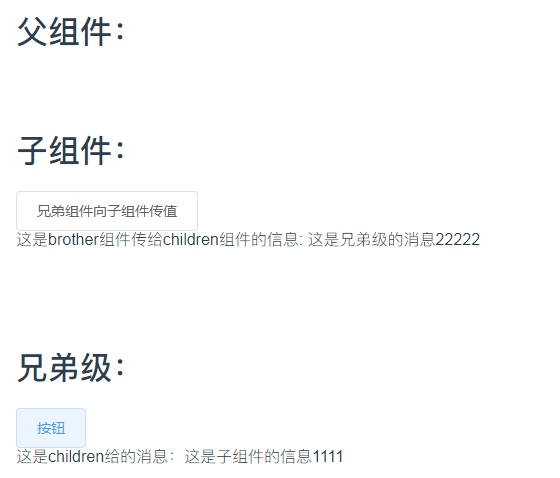

4. 父子或者兄弟组件的通信
```
// 创建事件bus
import Vue from 'vue'
export default new Vue();

// 注册
import Bus from 'utils/bus'
export default {
	data () {
		return{
			msg: ''
		}
	},
	created () {
		let me = this;
		Bus.$on('communication', function () {
			me.communicationEve()
		})
	},
	beforeDestroy () {
		Bus.$off('communication')
	},
	methods: {
		communicationEve () {
			console.log(11111)
			this.msg = '$on和$emit通信232222222'
		}
	}
}

// 使用
import Bus from 'utils/bus'
export default {
	methods: {
        tranEve () {
          Bus.$emit('communication')
        }
	}
}
```

#### 2.14 nextTick用法

```
第一种写法：
updateMessage: function () {
    this.message = '已更新'
    console.log(this.$el.textContent) // => '未更新'
    this.$nextTick(function () {
    	console.log(this.$el.textContent) // => '已更新'
    })
}

第二种写法：
因为 $nextTick() 返回一个 Promise 对象，所以使用新的 ES2017 async/await 语法完成相同的事情
updateMessage: async function () {
    this.message = '已更新'
    console.log(this.$el.textContent) // => '未更新'
    await this.$nextTick()
    console.log(this.$el.textContent) // => '已更新'
}
```

#### 2.15 Vue的响应式系统和依赖收集

Object.defineProperty()方法会直接在一个对象上定义一个新属性或者修改一个对象的现有属性并返回此对象。

> 应当直接在 [`Object`](https://developer.mozilla.org/zh-CN/docs/Web/JavaScript/Reference/Global_Objects/Object) 构造器对象上调用此方法，而不是在任意一个 `Object` 类型的实例上调用。
>
> ```
> // 对象初始化器（Object initialiser）或对象字面量（literal）
> { [ nameValuePair1[, nameValuePair2[, ...nameValuePairN] ] ] }
> 
> // 以构造函数形式来调用
> new Object([value])
> ```

> >语法：
> >
> >```
> >Object.defineProperty(obj, prop, descriptor)
> >```
> >
> >用法：
> >
> >const object1 = {};
> >
> >Object.defineProperty(object1, 'property1', {
> >
> >​	configurable: false, // 当且仅当该属性的 `configurable` 键值为 `true` 时，该属性的描述符才能够被改变，同时该属性也能从对应的对象上被删除
> >
> >​	enumerable: false, // 当且仅当该属性的 `enumerable` 键值为 `true` 时，该属性才会出现在对象的枚举属性中
> >
> >​	value: 42, // 该属性对应的值。可以是任何有效的 JavaScript 值（数值，对象，函数等）
> >
> >​	writable: false, // 当且仅当该属性的 `writable` 键值为 `true` 时，属性的值，也就是上面的 `value`，才能被[`赋值运算符`](https://developer.mozilla.org/zh-CN/docs/Web/JavaScript/Reference/Operators/Assignment_Operators)改变
> >
> >​	get () {return value},
> >
> >​	set (newValue) {value = newValue;}
> >
> >});
> >
> >object1.property1 = 77; // throws an error in strict mode
> >
> >console.log(object1.property1); // expected output: 42
> >
> >

vue的响应式原理： Vue通过Object.defineProperty方法把data对象的全部属性转化成getter/setter,当属性被访问或者修改时通知变化。

Vue 无法检测 property 的添加或移除。由于 Vue 会在初始化实例时对 property 执行 getter/setter 转化，所以 property 必须在 `data` 对象上存在才能让 Vue 将它转换为响应式的

对于已经创建的实例，Vue 不允许动态添加根级别的响应式 property。但是可以使用`Vue.set(object, propertyName, value)`方法向嵌套对象添加响应式property。或者使用别名`vm.$set`

如果为已有对象赋值多个新property，比如使用`Object.assign()`或者`_.extend()`。这样添加到对象上的新property不会触发更新。应该使用以下办法：

```
this.someObject = Object.assign({}, this.someObject, {a: 1, b: 2})
```

#### 2.16 favicon.ico不显示问题

解决方法一：修改index.html文件

```
<link rel="shortcut icon" type="image/x-icon" href="favicon.ico"/>
```

解决方法二：修改webpack配置文件

        1、找到build下的webpack.dev.conf.js文件

```
new HtmlWebpackPlugin({
      filename: 'index.html',
      template: 'index.html',
      inject: true,
      favicon: path.resolve('favicon.ico') // 增加
    }),
```

        2、找到build下的webpack.prod.conf.js文件

```
 new HtmlWebpackPlugin({
      filename: config.build.index,
      template: 'index.html',
      inject: true,
      favicon: path.resolve('favicon.ico'), //新增
      minify: {
        removeComments: true,
        ...
    }),
```

#### 2.7 mixins定义共用的变量

main.js全局引入：

```
import { tableFormatter } from '@/utils/tableFormatter'
Vue.mixin(tableFormatter)
```

局部引入：

```
import { tableFormatter } from '@/utils/tableFormatter'
export default {
	mixins: [tableFormatter],
}
```


tableFormatter.js内容：

```
import moment from 'moment'
export var tableFormatter = {
  data () {
  	return{}
  },
  created () {},
  methods: {
    statusFormatter () {
      return 'mixin test'
    },
    // 表格-时间格式化
    timeFormatter (row, column, cellValue, index) {
      if (cellValue === '' || cellValue === null) {
        return '暂无'
      } else {
        return moment(cellValue).format('YYYY-MM-DD HH:mm:ss')
      }
    },
    // 非表格-时间格式化
    timeFormat (cellValue) {
      if (cellValue === '' || cellValue === null) {
        return '暂无'
      } else {
        return moment(cellValue).format('YYYY-MM-DD HH:mm:ss')
      }
    },
    methodFormatter (row, column, cellValue, index) {
      var map = {
        1: '按单结',
        2: '延后结'
      }
      return map[cellValue] ? map[cellValue] : '未知'
    }
  }
}
```


#### 2.8 权限全局挂载 & 树形数据转换 & uuid

main.js全局挂载：

```
import { isAuth } from 'utils/index';
Vue.prototype.isAuth = isAuth;
```

index.js内容设置：

```
/**
 * 获取uuid
 */
export function getUUID () {
  return 'xxxxxxxx-xxxx-4xxx-yxxx-xxxxxxxxxxxx'.replace(/[xy]/g, c => {
    return (c === 'x' ? (Math.random() * 16 | 0) : ('r&0x3' | '0x8')).toString(16)
  })
}

/**
 * 是否有权限
 * @param {*} key
 */
export function isAuth (key) {
  return JSON.parse(sessionStorage.getItem('permissions') || '[]').indexOf(key) !== -1 || false
}

/**
 * 树形数据转换
 * @param {*} data
 * @param {*} id
 * @param {*} pid
 */
export function treeDataTranslate (data, id = 'id', pid = 'parentId') {
  var res = []
  var temp = {}
  for (var i = 0; i < data.length; i++) {
    temp[data[i][id]] = data[i]
  }
  for (var k = 0; k < data.length; k++) {
    if (temp[data[k][pid]] && data[k][id] !== data[k][pid]) {
      if (!temp[data[k][pid]]['children']) {
        temp[data[k][pid]]['children'] = []
      }
      if (!temp[data[k][pid]]['_level']) {
        temp[data[k][pid]]['_level'] = 1
      }
      data[k]['_level'] = temp[data[k][pid]]._level + 1
      temp[data[k][pid]]['children'].push(data[k])
    } else {
      res.push(data[k])
    }
  }
  return res
}
```

属性转换局部引入：

```
import { treeDataTranslate } from 'utils/index'
this.menuList = treeDataTranslate(data.menuList, 'menuId')
```


#### 2.9 tree半选中状态

处理方法一：

```
data () {
	return {
		tempKey: '-666666' // 临时key, 用于解决tree半选中状态项不能传给后台接口问题. # 待优化
	}
}

使用：
第一步：列表转树结构
this.menuList = treeDataTranslate(list, 'menuId')
第二步：
this.$nextTick(() => {
    this.$refs.menuListTree.setCheckedKeys([])
})
第三步：设置选中
var idx = data.role.menuIdList.indexOf(this.tempKey)
if (idx !== -1) {
	data.role.menuIdList.splice(idx, data.role.menuIdList.length - idx)
}
this.$refs.menuListTree.setCheckedKeys(data.role.menuIdList)
```

```
treeDataTranslate文件：
export function treeDataTranslate (data, id = 'id', pid = 'parentId', disabled = 'false') {
  var res = []
  var temp = {}
  for (var i = 0; i < data.length; i++) {
    temp[data[i][id]] = data[i]
    if (disabled) { // 用于查看
      temp[data[i][id]].disabled = disabled
    }
  }
  for (var k = 0; k < data.length; k++) {
    if (temp[data[k][pid]] && data[k][id] !== data[k][pid]) {
      if (!temp[data[k][pid]]['children']) {
        temp[data[k][pid]]['children'] = []
      }
      if (!temp[data[k][pid]]['_level']) {
        temp[data[k][pid]]['_level'] = 1
      }
      data[k]['_level'] = temp[data[k][pid]]._level + 1
      if (disabled) { // 用于查看
        data[k].disabled = disabled
      }
      temp[data[k][pid]]['children'].push(data[k])
    } else {
      res.push(data[k])
    }
  }
  return res
}
```


处理方法二：

```
<el-tree ref="tree" :data="data" show-checkbox node-key="id" @check="getCheck" :check-strictly="checkFlag" default-expand-all :props="defaultProps"></el-tree>
```

```
getCheck(currentObj, treeStatus) {
      // 用于：父子节点严格互不关联时，父节点勾选变化时通知子节点同步变化，实现单向关联。
      let selected = treeStatus.checkedKeys.indexOf(currentObj.id); // -1未选中
      // 选中
      if (selected !== -1) {
        // 子节点只要被选中父节点就被选中
        this.selectedParent(currentObj);
        // 统一处理子节点为相同的勾选状态
        if (currentObj.resourceType !== 3) {
          this.uniteChildSame(currentObj, true);
        }
      } else {
        // 未选中 处理子节点全部未选中
        if (currentObj.children.length !== 0) {
          this.uniteChildSame(currentObj, false);
        }
        this.unSelectedParent(currentObj);
      }
    },
    // 统一处理子节点为相同的勾选状态
    uniteChildSame(treeList, isSelected) {
      this.$refs.tree.setChecked(treeList.id, isSelected)
      for (let i = 0; i < treeList.children.length; i++) {
        this.uniteChildSame(treeList.children[i], isSelected)
      }
    },
    // 处理父节点未选中状态
    unSelectedParent(currentObj) {
      let currentNode = this.$refs.tree.getNode(currentObj);
      let tree = this.$refs.tree.getCheckedKeys();
      console.log(tree);
      if (currentNode.parent.key !== undefined) {
        let parentNode = currentNode.parent;
        var num = -1;
        for (let i = 0; i < parentNode.data.children.length; i++) {
          for (let j = 0; j < tree.length; j++) {
            if (parentNode.data.children[i].id === tree[j]) {
              num = 1;
              return;
            }
          }
        }
        if (num === -1) {
          this.$refs.tree.setChecked(currentNode.parent, false);
          this.unSelectedParent(currentNode.parent, tree)
        }
      }
    },
    // 统一处理父节点为选中
    selectedParent(currentObj) {
      let currentNode = this.$refs.tree.getNode(currentObj);
      if (currentNode.parent.key !== undefined) {
        this.$refs.tree.setChecked(currentNode.parent, true);
        this.selectedParent(currentNode.parent)
      }
    }
```


#### 2.10 store用法

储存初始状态（非必要）

安装lodash

```
npm i -save lodas
```

main.js

```
import cloneDeep from 'lodash/cloneDeep'
// 保存整站vuex本地储存初始状态
window.SITE_CONFIG['storeState'] = cloneDeep(store.state)
```

store的使用：

安装vuex

```
npm install vuex --save
```

文件夹路径：

store ---- index.js

​		|---- modules ---- user.js

1. main.js中引用：
```
import store from './store'
new Vue({
  el: '#app',
  router,
  store,
  template: '<App/>',
  components: { App }
})
```
2. index.js

```
import Vue from 'vue'
import Vuex from 'vuex'
import cloneDeep from 'lodash/cloneDeep'
import common from './modules/common'

Vue.use(Vuex)

export default new Vuex.Store({
  modules: {
    common
  },
  mutations: {
    // 重置vuex本地储存状态
    resetStore (state) {
      Object.keys(state).forEach((key) => {
        state[key] = cloneDeep(window.SITE_CONFIG['storeState'][key])
      })
    }
  },
  strict: process.env.NODE_ENV !== 'production'
})
```

3. common.js
```
export default {
  namespaced: true,
  state: {
    menuActiveName: ''
  },
  mutations: {
    updateMenuActiveName (state, name) {
      state.name = name
    }
  }
}
```

4. 使用
```
computed: {
    menuActiveName: {
        get () { return this.$store.state.common.menuActiveName },
        set (val) { this.$store.commit('common/updateMenuActiveName', val) }
    }
}
```


#### 2.11 无限弹幕效果

代码引用：

```
<template>
	<div>
		<div class="danmu_container" id="danmu_container"></div>
	</div>
</template>
```

配置与设置：

```
import DanMu from '../utils/danmu';
export default {
  data() {
    return {}
  },
  mounted() {
    this.initDanmu();
  },
  methods: {
    initDanmu() {
      document.getElementById('danmu_container').innerHTML = '';
      DanMu.init({
        square: document.getElementById('danmu_container'), // 容器
        color: ['rgba(0,0,0,0.3)', 'rgba(0,0,0,0.6)', 'rgba(0,0,0,0.2)', 'rgba(0,0,0,0.7)', 'rgba(0,0,0,0.4)', 'rgba(0,0,0,0.5)'], // 可传数组可传单个，默认彩色
        // fontsize: '', //可传数组可传单个，默认随机16-26px
        road_high: 48, // 行高
        road_padding: 0, // 每行中是否固定边界距离，不传不固定
        road_per_runner: 17, // 每行中最多的数量
        show_lines: false, // 是否显示边界线条，作为参考
        click_call(dom) { // 弹幕内容被点击回调
          console.log('文本值', dom.innerText);
        },
        duration: 12, // 控制速度，最小为1，不传默认
        // stopElementId: 'control', // 开始暂停按钮id名
        runners: [
          '安溪县人民法院', '天长市人民法院', '四川省自贡市中级人民法院'。。。。。。等等公司
        ]
      });
    }
  }
}
```

#### 2.12 预防浏览器工具调试

```
var div = document.createElement('div');
var loop = setInterval(function () {
    console.log(div);
    console.clear();
}, 200);

Object.defineProperty(div, "id", {
    get: function () {
        clearInterval(loop);
        //alert("禁止非法调试！请关闭开发者工具！");
        //location.href = "/WebPages/Home/AttackError";
        alert("禁止非法调试！请关闭开发者工具！")
        setInterval(breakDebugger, 100);//防止其他外部调试
    }
});

function checkDebugger() {
    var d = new Date();
    debugger;
    var dur = Date.now() - d;
    if (dur < 5) {
        return false;
    } else {
        //location.href = "/WebPages/Home/AttackError";
        alert("禁止非法调试！请关闭开发者工具！")
        return true;
    }
}
function breakDebugger() { if (checkDebugger()) { breakDebugger(); } }

//其他扩展：

//禁止右键
$(document).bind("contextmenu", function () { return false; });

////屏蔽f12, ctrl
//$(document).bind("keydown ", function (e) {
//    if (e.keyCode === 123 || e.keyCode === 17) { //屏蔽F12 ctrl
//        e.preventDefault();
//        return false;
//    }
//    return true;
//});


var preventCtrl = function (e) {

    if (e.keyCode === 123) { //屏蔽F12 
        e.preventDefault();
        return false;
    } else if (e.keyCode === 17) { //ctrl
        console.log("prevent keycode s");
        document.onkeydown = preventS;
        return false;
    }
    return true;
}

var preventS = function (e) {
    if (e.keyCode === 123 || e.keyCode === 83) { //屏蔽F12 ctrl
        e.preventDefault();
        return false;
    }
    return true;
}

var nopreventS = function (e) {
    if (e.keyCode === 17) {
        console.log("no prevent keycode s");
        document.onkeydown = preventCtrl;
    }
}

//屏蔽f12, ctrl
document.onkeydown = preventCtrl;
document.onkeyup = nopreventS;

//禁止复制
$(document).bind("selectstart", function (e) { e.preventDefault(); });
```

#### 2.13 el-date-picker type="datetime"时报错 

项目中运行el-date-picker type="datetime"时一直报[Vue warn]: Error in render: "TypeError: (this.format || "").indexOf is not a function"错误

原因：

tableFormatter.js中timeFormat定义的方法和el-date-picker定义的方法冲突了。。。。。。切记


#### 2.14 3D旋转图片，左右点击轮播图

引入global-zoom-pic.vue文件

功能：自动轮播、随着轮播下面字的替换

页面上代码：

```
<div :style="pageStyle">
    <div class="content-zoom-pic">
        <globalZoomPic @updateDesc="updateDesc" />
        <!--最下面的架子样式-->
        <div class="desktop-wrap"></div>
        <div class="swiper-desc">{{currentDesc}}</div>
    </div>
</div>

<script>
import globalZoomPic from '../../components/global-zoom-pic';
export default {
  data() {
    return {
      currentDesc: '',
      pageStyle: {}
    }
  },
  components: { globalZoomPic },
  mounted() {
  	// 手机适配的时候高度过低问题
    let pageContainer = {};
    let pageContainerHeight = '';
    if (window.getComputedStyle) {
      pageContainer = window.getComputedStyle(document.querySelectorAll('.el-container')[0])
    }
    pageContainerHeight = +pageContainer.height.replace('px', '');
    if (pageContainerHeight < window.innerHeight) {
      this.pageStyle = {
        paddingBottom: (window.innerHeight - pageContainerHeight) + 'px'
      }
    }
  },
  methods: {
    updateDesc(data) {
      this.currentDesc = data.desc;
    }
  }
}
</script>

<style>
.content-zoom-pic {
  width: 100%;
  max-width: 1591px;
  margin: 0 auto;
  padding-bottom: 72px;
  .desktop-wrap {
    position: absolute;
    width: 1591px;
    height: 58px;
    margin: 0 auto;
    text-align: center;
    background: url("../../static/img/widget/honor-desktop.png") no-repeat
      scroll center;
    background-size: 100%;

    @media screen and(max-width: 1591px) {
      width: 100%;
    }
  }
  .swiper-desc {
    margin-top: 80px;
    font-size: 20px;
    font-family: PingFang SC;
    font-weight: 400;
    line-height: 28px;
    color: #2d2f33;
    opacity: 1;
  }
}
</style>
```

效果图：

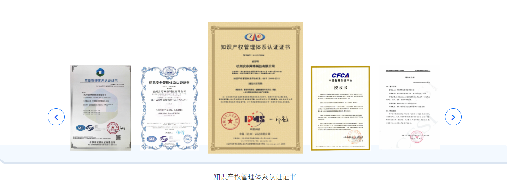


#### 2.15 腾讯官网效果

[腾讯网站](file:///F:/poppy/%E7%AC%94%E8%AE%B0/img/tencent-demo/zh-cn/index.html)

1. video在ISO下的自动播放

```
代码：
<video width="100%" id="video" autoplay="" loop="" preload="" muted="" x-webkit-airplay="true" airplay="allow" webkit-playsinline="true" playsinline="true" src="index_files/index-video.mp4" class="video1 video"></video>

if($('.video1')[0]){
		//banner
		var isBanner = false;
		var isBannerI = 0;

		var u = navigator.userAgent;
		if (u.indexOf('Android') > -1 || u.indexOf('Linux') > -1) {//安卓手机
			$('.video1').hide();
			$('.banner_txt').addClass('animation');
			} else if (u.indexOf('iPhone') > -1) {//苹果手机
				document.addEventListener("WeixinJSBridgeReady", function () {
					   $('#video')[0].play()
				}, false);
				} else if (u.indexOf('Windows Phone') > -1) {//winphone手机
					$('.video1').hide();
					$('.banner_txt').addClass('animation');
			}


		$('.video1')[0].onplaying = function (){
			$('.banner_txt').addClass('animation');
			isBanner = true;
		}


		setInterval(function (){
			if(isBanner){
				if($('.video1')[0].currentTime < 0.5){
					if(isBannerI){
						$('.banner_txt .hook_area').addClass('animation1');
					}
					$('.banner_txt .hook_area').removeClass('animation2');
					$('.banner_txt .hook_area').removeClass('animation3');
					$('.banner_txt .hook_area').removeClass('animation4');
				}

				if($('.video1')[0].currentTime > 2.7){
					isBannerI = 1;
					$('.banner_txt .hook_area').addClass('animation2');
				}
				if($('.video1')[0].currentTime > 4.5){
					$('.banner_txt .hook_area').addClass('animation3');
				}
				if($('.video1')[0].currentTime > 6.4){
					$('.banner_txt .hook_area').addClass('animation4');
				}
			}

		},1000/24);
	}
```

#### 2.16 左右移动效果

```
<template>
  <div>
    <div class="win-wrap">
      <div :class="['box-wrap', cur == 1 ? 'box-wrap-1' : '']">
        
        
      </div>
    </div>
    <ul class="btn-wrap">
      <li v-for="(item, index) in liList" :key="item.id" :class="cur == index ? 'active' : ''" @click="changeLi(index)"></li>
    </ul>
  </div>
</template>
<script>
export default {
  data() {
    return {
      cur: 0,
      liList: [
        { id: 1 },
        { id: 2 }
      ]
    }
  },
  mounted() { },
  methods: {
    changeLi(index) {
      this.cur = index
    }
  }
}
</script>

<style lang="scss" scoped>
.btn-wrap {
  text-align: center;
  margin: 30px auto 50px;
  li {
    display: inline-block;
    width: 8px;
    height: 8px;
    border-radius: 4px;
    margin: 0 2px;
    background-color: $theme-color;
    opacity: 0.3;
    cursor: pointer;
    transition: all 0.2s linear;
  }
  li.active {
    width: 20px;
    opacity: 1;
  }
}
.win-wrap{
  position: relative;
  width: 920px;
  height: 390px;
  overflow: hidden;
  margin: 120px auto 0;
  .box-wrap{
    width: 2000px;
    position: absolute;
    top: 0;
    left: 0;
    transition: all 0.2s linear;
    &.box-wrap-1{
      left: -920px;
    }
    img{
      float: left;
    }
  }
}
</style>
```

效果图如下：


#### 2.17 隔页多选

一种：接口访问数据

```
<!-- html代码 -->
<template>
<div>
<el-button type="primary" @click="exportHandle">批量导出</el-button>
<el-table
    :data="dataList"
    border
    stripe
    v-loading="dataListLoading"
    @selection-change="selectionChangeHandle"
    ref="dealTable"
    style="width: 100%;">
    <el-table-column
    type="selection"
    header-align="center"
    :selectable="selectEvent"
    align="center">
    </el-table-column>
    <el-table-column
    prop="caseNumber"
    header-align="center"
    align="center"
    :show-overflow-tooltip="true"
    label="案件编号">
    </el-table-column>
</el-table>
</div>
</template>
<script>
export default {
  data () {
    return {
      dataList: [],
      totalPage: 0,
      curPage: 0,
      formData: {
        page: 1,
        limit: 20
      },
      mediatorList: [],
      allSlectList: [],
      caseIds: []
    }
  },
  methods: {
    // 获取数据列表
    getDataList (val) {
      this.dataListLoading = true
      this.$http({
        url: this.$http.adornUrl('/mediate/mediation/list'),
        method: 'post',
        data: this.$http.adornParams(this.formData)
      }).then(({data}) => {
        if (data && data.code === 200) {
          this.dataList = data.page.list;
          this.totalPage = data.page.totalCount
          if (val) {
            this.middleHandle(val)
          }
        } else {
          this.$message.warning(data.msg)
          this.dataList = []
        }
        this.dataListLoading = false
      })
    },
    toggleSelection (rows) {
      if (rows) {
        this.$nextTick(() => {
          rows.forEach(row => {
            this.$refs.dealTable.toggleRowSelection(row);
          });
        })
      } else {
        this.$refs.dealTable.clearSelection();
      }
    },
    // 每页数
    sizeChangeHandle (val) {
      this.curPage = 0
      this.formData.limit = val;
      this.formData.page = 1;
      this.allSlectList = []
      this.caseIds = []
      this.$refs.dealTable.clearSelection();
      this.getDataList()
    },
    // 当前页
    currentChangeHandle (val) {
      this.formData.page = val;
      this.getDataList(val)
    },
    // 多选
    selectionChangeHandle (val) {
      this.caseIds = []
      if (val.length > 0) {
        for (let i = 0; i < val.length; i++) {
          this.caseIds.push(val[i].caseId)
        }
      }
    },
    // 筛选选择
    selectEvent (row, index) {
      if (row.caseStatus == 1) {
        return true
      } else {
        return false
      }
    },
    middleHandle (val) {
      let n = this.curPage
      this.allSlectList[n] = this.caseIds && this.caseIds.length > 0 ? this.caseIds : []
      if (this.allSlectList.length > 0) {
        for (let i = 0; i < this.allSlectList.length; i++) {
          if (i == val - 1) {
            this.caseIds = this.allSlectList[i] || []
            let list = this.allSlectList[i] || []
            let list1 = []
            list.forEach(item => {
              this.dataList.forEach(list => {
                if (item == list.caseId) {
                  list1.push(list)
                }
              })
            })
            this.toggleSelection(list1)
          }
        }
      }
      this.curPage = val - 1
    },
    // 批量导出
    exportHandle () {
      this.allSlectList[this.curPage] = this.caseIds && this.caseIds.length > 0 ? this.caseIds : []
      if (this.allSlectList.length > 0) {
        let list = []
        this.allSlectList.forEach(item => {
          if (item && item.length > 0) {
            item.forEach(obj => {
              list.push(obj)
            })
          }
        })
        this.$http({
          url: this.$http.adornUrl('/mediate/mediation/batchExport'),
          method: 'post',
          responseType: 'arraybuffer',
          data: this.$http.adornParams({
            ids: list
          })
        }).then(res => {})
      } else {
        this.$message.warning('请选择导出案件')
      }
    }
  }
 }

```

二种：已有数据（类似数据校验）

```
<el-table :data="items" stripe style="width: 100%"  @selection-change="selectionChangeHandle" ref="dataTable">
    <el-table-column
    type="selection"
    header-align="center"
    align="center">
    </el-table-column>
    <el-table-column prop="preserveNo" label="存证编号" show-overflow-tooltip></el-table-column>
</el-table>
<script>
export default {
    data() {
        return {
            selectList: [],
            allSlectList: [],
            caseIds: []
        }
    },
    methods: {
        toggleSelection (rows) {
          if (rows) {
            rows.forEach(row => {
              this.$refs.dataTable.toggleRowSelection(row);
            });
          } else {
            this.$refs.dataTable.clearSelection();
          }
        },
        handleCurrentPageChange(val) {
          this.pagination.page = val;
          this.findAll()
          let n = val
          this.allSlectList[n] = this.selectList && this.selectList.length > 0 ? this.selectList : []
          if (this.allSlectList.length > 0) {
            for (let i = 0; i < this.allSlectList.length; i++) {
              if (i == val) {
                this.selectList = this.allSlectList[i] || []
                let time = setTimeout(() => {
                  this.toggleSelection(this.allSlectList[i])
                  clearTimeout(time)
                }, 10)
              }
            }
          }
        },
        // 多选
        selectionChangeHandle (val) {
          this.selectList = val
          this.caseIds = []
          if (val.length > 0) {
            for (let i = 0; i < val.length; i++) {
              this.caseIds.push(val[i].id)
            }
          }
        }
    }
}

```


#### 2.18 v-for和v-if同时使用

错误写法：

```
<ul>
  <li
    v-for="user in users"
    v-if="user.isActive"
    :key="user.id">
    {{ user.name }}
  </li>
</ul>
```

正确写法：

```
<ul>
  <li
    v-for="user in activeUsers"
    :key="user.id">
    {{ user.name }}
  </li>
</ul>

computed: {
  activeUsers: function () {
    return this.users.filter(function (user) {
   		return user.isActive
    })
  }
}
```


#### 2.20 图片懒加载

1. 安装

```
npm install vue-lazyload --save-dev
```

2. main.js引入

```
import VueLazyload from 'vue-lazyload'

Vue.use(VueLazyload)
or
Vue.use(VueLazyload, {
    preLoad: 1.3,
    error: 'dist/error.png',
    loading: 'dist/loading.gif',
    attempt: 1
})

```

3.  使用
```

```

#### 2.21 vue性能优化

##### 1. **Webpack 对图片进行压缩**


#### 2.22 比较两个对象是否相同

```
isObjectValueEqual (a, b) {
      var aProps = Object.getOwnPropertyNames(a);
      var bProps = Object.getOwnPropertyNames(b);
      if (aProps.length != bProps.length) {
        return false;
      }
      for (var i = 0; i < aProps.length; i++) {
        var propName = aProps[i];
        if (a[propName] !== b[propName]) {
          if ((typeof (a[propName]) == 'number' && isNaN(a[propName])) || propName == '__ob__') {} else {
            return false;
          }
        }
      }
      return true;
    }
```

#### 2.23 验证码
使用：
```
<el-form-item prop="verificationCode">
    <div class="code-wrap">
        <el-input v-model="dataForm.verificationCode" placeholder="验证码" autofocus>
            <icon-svg slot="prefix" name="safe" class="el-input__icon"></icon-svg>
        </el-input>
        <el-button class="code-btn red-btn" type="primary" @click="getCaptcha" :disabled="isDisabled">{{text}}</el-button>
    </div>
</el-form-item>
```
计算：

```
computed: {
    text () {
    	return this.time > 0 ? this.time + 's 后重新获取' : '获取验证码';
    }
}
```
倒计时：


```

getCaptcha () {
        this.$refs['dataForm'].validateField('mobile', (errorMessage) => {
          if (!errorMessage) {
            this.dataForm.uuid = getUUID()
            this.$http({
              url: this.$http.adornUrl(`/sys/sendCaptcha`),
              method: 'post',
              params: this.$http.adornParams({
                'number': this.dataForm.mobile,
                'uuid': this.dataForm.uuid
              })
            }).then(({data}) => {
              if (data && data.code === 0) {
                this.isDisabled = true
                this.isAcquire = true
                this.value = this.dataForm.mobile
                this.$message.success('验证码发送成功')
                clearInterval(this.timer);
                if (this.isDisabled) {
                  this.time = 60;
                  let me = this;
                  this.timer = setInterval(function () {
                    if (me.time > 0) {
                      me.time--;
                    }
                    if (me.time <= 0) {
                      me.isDisabled = false;
                      clearInterval(me.timer)
                    }
                  }, 1000)
                }
              } else {
                this.$message.warning(data.msg)
              }
            })
          }
        })
      }
```

提交

```

            if (!this.isAcquire) {
              this.$message.warning('请先获取验证码')
              return false
            }
            if (this.value != this.dataForm.mobile) {
              this.$message.warning('请重新获取验证码')
              clearInterval(this.timer)
              return false
            }
```

样式

```

.code-wrap{
  display: flex;
  .code-btn{
    margin-left: 10px;
  }
}
```


 #### 2.24 获取窗口大小

```
mounted () {
	this.resetDocumentClientHeight()
},
methods: {
// 重置窗口可视高度
    resetDocumentClientHeight () {
        this.documentClientHeight = document.documentElement['clientHeight']
        window.onresize = () => {
        	this.documentClientHeight = document.documentElement['clientHeight']
        }
    }
}
```


#### 2.25 列表倒计时

前台：

```
<template>
<el-table
      :data="dataList"
      border
      style="width: 100%">
      <el-table-column
        header-align="center"
        align="center"
        label="倒计时">
        <template slot-scope="scope">
          <countTime :endtime="new Date(scope.row.nextStartTime).getTime() - new Date(scope.row.nowTime).getTime()" v-if="new Date(scope.row.nextStartTime).getTime() - new Date(scope.row.nowTime).getTime() > 0"></countTime>
          <span v-else>--</span>
        </template>
      </el-table-column>
    </el-table>
</template>

<script>
import countTime from '@/components/countTime'
export default {
  data () {
    return {}
  },
  components: {
    countTime
  }
}
</script>
```

countTime组件内容：

```
<template>
  <div>{{time}}</div>
</template>

<script>
export default {
  props: ['endtime'],
  data () {
    return {
      time: '',
      flag: false
    }
  },
  mounted () {
    let self = this;
    let countTime = self.endtime;
    let dd = Math.floor(countTime / 1000 / 60 / 60 / 24);
    let hh = Math.floor((countTime / 1000 / 60 / 60) % 24);
    let mm = Math.floor((countTime / 1000 / 60) % 60);
    let ss = Math.floor((countTime / 1000) % 60);
    let day = Math.floor(countTime / 1000 / 60 / 60 / 24)
    dd = dd > 9 ? dd : '0' + dd
    hh = hh > 9 ? hh : '0' + hh
    mm = mm > 9 ? mm : '0' + mm
    ss = ss > 9 ? ss : '0' + ss
    self.time = (day > 0 ? dd + '天 ' : '') + hh + ':' + mm + ':' + ss
    let time = setInterval(function () {
      if (self.flag) {
        clearInterval(time);
      }
      countTime = countTime - 1000;
      self.timeDown(countTime);
    }, 1000)
  },
  methods: {
    timeDown (endTime) {
      if (endTime <= 1000) {
        this.flag = true;
        this.time = '--'
        return false
      }
      let dd = Math.floor(endTime / 1000 / 60 / 60 / 24);
      let hh = Math.floor((endTime / 1000 / 60 / 60) % 24);
      let mm = Math.floor((endTime / 1000 / 60) % 60);
      let ss = Math.floor((endTime / 1000) % 60);
      let day = Math.floor(endTime / 1000 / 60 / 60 / 24)
      dd = dd > 9 ? dd : '0' + dd
      hh = hh > 9 ? hh : '0' + hh
      mm = mm > 9 ? mm : '0' + mm
      ss = ss > 9 ? ss : '0' + ss
      this.time = (day > 0 ? dd + '天 ' : '') + hh + ':' + mm + ':' + ss
    }
  }
}
</script>

```


#### 2.26 上级菜单选择

```

      <el-form-item label="所属上级：" prop="parentName">
        <el-popover
          ref="menuListPopover"
          placement="bottom-start"
          trigger="click">
          <el-tree
            :data="menuList"
            :props="menuListTreeProps"
            node-key="id"
            ref="menuListTree"
            @current-change="menuListTreeCurrentChangeHandle"
            :default-expand-all="true"
            :highlight-current="true"
            :expand-on-click-node="false">
          </el-tree>
        </el-popover>
        <el-input v-model="dataForm.parentName" v-popover:menuListPopover :readonly="true" placeholder="点击选择所属上级" class="menu-list__input"></el-input>
      </el-form-item>
```

初始化：

```

        dataForm: {
          parentId: 0,
          parentName: '',
        },
        menuList: [],
        menuListTreeProps: {
          label: 'permissionName',
          children: 'children'
        },
```

方法：

```

      init (id, row) {
        this.dataForm.id = id || ''
        this.$http({
          url: this.$http.adornUrl('/sys/permission/menu'),
          method: 'get',
          data: this.$http.adornData()
        }).then(res => {
          if (res && res.code === '0000000') {
            this.menuList = [{id: 0, parentId: -1, permissionName: '一级菜单', children: res.data}]
          }
        }).then(() => {
          this.visible = true
          this.$nextTick(() => {
            this.$refs['dataForm'].resetFields()
          })
        }).then(() => { // 必须在上一个.then()之后，不然会报错
          if (!this.dataForm.id) {
            this.menuListTreeSetCurrentNode()
          } else {
            this.dataForm.permissionName = row.permissionName
            this.dataForm.permissionDescription = row.permissionDescription
            this.dataForm.parentId = row.parentId || 0
            this.dataForm.permissionStatus = row.permissionStatus ? 1 : 0
            this.dataForm.permissionSort = row.permissionSort
            this.dataForm.permissionUrl = row.permissionUrl
            this.dataForm.permissionType = row.permissionType
            this.menuListTreeSetCurrentNode()
          }
        })
      },
      // 菜单树选中
      menuListTreeCurrentChangeHandle (data, node) {
        this.dataForm.parentId = data.id
        this.dataForm.parentName = data.permissionName
      },
      // 菜单树设置当前选中节点
      menuListTreeSetCurrentNode () {
        this.$refs.menuListTree.setCurrentKey(this.dataForm.parentId)
        this.dataForm.parentName = (this.$refs.menuListTree.getCurrentNode() || {})['permissionName']
      }
```

#### 2.27 base65中文解码乱码问题

问题：后端生成的base64在url传给前端的时候，前端解析失败或者乱码

解决问题：

1. 后端的参数传给前端的时候需要再encode一下，url会自动将数据转义
2. 前端到的数据一般情况下是没有问题的，但是有的时候编码里面会有+代表的空符号，这个时候前端要先处理下获取到的参数：
```
urlStr = urlStr.replace(/[\s]+/g, '+')
```

用这个方法将空格替换成+号后，再对base64编码进行解码，就不会报错了

#### 2.28 position: sticky;使用

效果参考[百度云](https://cloud.baidu.com/solution/blockchain.html?track=cp:nsem|pf:PC|pp:nsem-tongan-liuliang-qukuailianpingtai|pu:qukuailianpingtai|ci:|kw:10158721&renqun_youhua=2781229)

position:sticky;兼容性不是很好，如下：

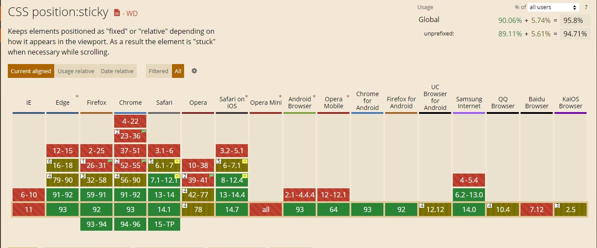

兼容的浏览器可以用这个特性不可以的话，利用fixed和absoute来实现效果，例子如下：

```

    <section class="product-content">
      <div :class="['product-wrap', !(!isIE && positionType === 2) ? (!isIE && positionType === 3) ? 'polyfill-bottom' : '' : 'polyfill-sticky']">
        <div class="part-title" style="padding-bottom: 0">应用场景</div>
        <div class="product-img" id="product-img" :style="{'position': 'sticky', 'background-position': bgPosi}"></div>
        <div class="product-list-wrap">
          <div class="case-wrap">
            <h2 class="title">互联网医院支链</h2>
            <div class="case-item-list">
              <div class="case-item-wrap">
                
                <div class="text-wrap">
                  <p class="title">可信诊疗过程</p>
                  <p class="desc">电签+结果上链存证</p>
                </div>
              </div>
              <div class="case-item-wrap">
                
                <div class="text-wrap">
                  <p class="title">可信医疗资质</p>
                  <p class="desc">资质上链+CA认证+可信声明</p>
                </div>
              </div>
              ...
            </div>
            <!-- <a class="link-btn" href="##" target="_blank">了解详情</a> -->
          </div>
          
          <div class="case-wrap">
              <h2 class="title">公益链</h2>
              <div class="case-item-list">
                <div class="case-item-wrap">
                    
                    <div class="text-wrap">
                        <p class="title">链上发布</p>
                        <p class="desc">公益项目信息链上<br/>存证记录</p>
                    </div>
                </div>
                <div class="case-item-wrap">
                    
                    <div class="text-wrap">
                        <p class="title">链上募集</p>
                        <p class="desc">募集款项明细链上存证<br/>链上公示</p>
                    </div>
                </div>
                ...
              </div>
              <!-- <a class="link-btn" href="##" target="_blank">了解详情</a> -->
          </div>

        </div>
        <div class="step-wrap">
          <div class="progress-dot cur"></div>
          <div class="progress-wrap">
            <div class="progress" style="height: 80px;"></div>
          </div>
          <div :class="['progress-dot', current >= 2 ? 'cur' : '']"></div>
          <div class="progress-wrap">
            <div class="progress" :style="{'height': current >= 2 ? '80px' : '0'}"></div>
          </div>
          ...
        </div>
      </div>
    </section>
```

```

<script>
export default {
  data () {
    return {
      bgPosi: '0 -110px',
      positionType: 1,
      isIE: false
    }
  },
  created () {
    window.addEventListener('scroll', this.handleScroll, true);
  },
  mounted () {
    this.isIE = document.getElementById('product-img').style.position === 'sticky'
  },
  destroyed () {
    window.removeEventListener('scroll', this.handleScroll, true);
  },
  methods: {
    handleScroll () {
      let scrollTop = window.pageYOffset || document.documentElement.scrollTop || document.body.scrollTop || 0;
      if (scrollTop > 1540 && scrollTop < 1942) {
        this.bgPosi = '0 -110px'
        this.current = 1
      } else if (scrollTop > 1941 && scrollTop < 2208) {
        this.bgPosi = '0 -227px'
        this.current = 2
      }
    }
  }
}
</script>

<style lang="scss" scoped>
.product-wrap{
  position: relative;
  width: 1200px;
  margin: 0 auto;
  padding-bottom: 110px;
  &:after {
    content: "";
    display: block;
    clear: both;
  }
  .product-img{
    position: -webkit-sticky;
    position: -moz-sticky;
    position: -ms-sticky;
    position: sticky;
    top: 100px;
    float: left;
    width: 460px;
    height: 493px;
    margin-top: 90px;
    border: 7px solid #DBE9FE;
    border-radius: 7px;
    background-image: url('../../assets/images/website/apply-img.jpg');
    background-repeat: no-repeat;
    background-position: 0 -110px;
    background-size: 913px;
    transition: background-position .4s ease-in-out,background-size .4s ease-in-out;
  }
  .product-list-wrap{
    float: left;
    width: 580px;
    height: 100%;
    margin-top: 60px;
    // margin-left: 540px;
    margin-left: 80px;
    .case-wrap{
      &:not(:first-child) {
        margin-top: 96px;
      }
      .title{
        font-size: 24px;
        font-weight: 500;
        line-height: 56px;
        color: #262626;
      }
      .case-item-list{
        width: 550px;
        overflow: hidden;
      }
      .case-item-wrap {
        float: left;
        margin-top: 10px;
        margin-bottom: 12px;
        color: #262626;
        .icon {
          width: 42px;
          padding-top: 5px;
          vertical-align: top;
        }
        .icon-w37 {
          width: 37px;
        }
        .icon-w39 {
          width: 39px;
        }
        .icon-w45 {
          width: 45px;
        }
        .text-wrap {
          display: inline-block;
          word-break: break-all;
          margin-left: 10px;
          .title{
            font-size: 16px;
            line-height: 26px;
            color: #262626;
            font-weight: bold;
            padding: 0;
            margin: 0;
          }
          .desc{
            color: #9e9e9e;
            font-size: 16px;
            margin-top: 6px;
            line-height: 20px;
            height: 40px;
          }
        }
        &:nth-child(2n + 1){
          width: 216px;
          .text-wrap {
            width: 140px;
          }
        }
        &:nth-child(2n){
          margin-left: 40px;
          width: 285px;
          .text-wrap {
            width: 220px;
          }
        }
      }
      .link-btn {
        display: inline-block;
        box-sizing: border-box;
        width: 155px;
        height: 38px;
        margin-top: 20px;
        font-size: 14px;
        line-height: 38px;
        text-align: center;
        color: #fff;
        border-radius: 22px;
        background: #2164ed;
        transition: all .2s ease-in-out;
        &:hover{
          background: #004de9;
          box-shadow: 0 0 0 2px #e5e9f0;
          cursor: pointer;
        }
      }
    }
  }
  .step-wrap{
    position: -webkit-sticky;
    position: -moz-sticky;
    position: -ms-sticky;
    position: sticky;
    // right: 0;
    top: 100px;
    float: left;
    margin: 100px 0 0 70px;
    .progress-wrap {
      width: 1px;
      height: 80px;
      margin: 0 auto;
      background: #cad0db;
      .progress {
        width: 1px;
        height: 80px;
        background: #2468f2;
      }
    }
    .progress-dot {
      width: 9px;
      height: 9px;
      margin: 8px auto;
      border-radius: 4.5px;
      background: #cad0db;
      &.cur {
        background: #2468f2;
      }
    }
  }
}
.polyfill-sticky{
  .product-img{
    position: fixed;
    top: 120px;
    margin-top: 0;
  }
  .product-list-wrap{
    margin-left: 540px;
  }
  .step-wrap{
    position: fixed;
    top: 120px;
    right: calc(50% - 600px);
    margin-top: 0;
  }
}
.polyfill-bottom{
  .product-img{
    position: absolute;
    bottom: 110px;
    top: auto;
    margin-top: 0;
  }
  .product-list-wrap{
    margin-left: 540px;
  }
  .step-wrap{
    position: absolute;
    bottom: 110px;
    top: auto;
    right: calc(50% - 600px);
    margin-top: 0;
  }
}
</style>
```


#### 2.29 拖拽

```
<template>
  <div id="content">
    <transition-group name="flip-list" class="box">
      <div v-for="item in items" :key="item" draggable="true" class="items" :class="{'active': oldVal === item && isActive === item}" @dragstart="dragstart(item)" @dragenter="dragenter(item)" @dragend="dragend(item)">
        {{item}}
      </div>
    </transition-group>
  </div>
</template>
<script>
export default {
  data() {
    return {
      items: [1, 2, 3, 4, 5, 6, 7, 8, 9],
      isActive: 0,
      oldVal: 0,
      newOld: 0
    }
  },
  mounted() {
  },
  methods: {
    dragstart(val) {
      this.oldVal = val;
      this.isActive = val;
    },
    dragend(val) {
      if (this.oldVal != this.newOld) {
        let oldIndex = this.items.indexOf(this.oldVal);
        let newIndex = this.items.indexOf(this.newOld);
        let newItems = [...this.items];
        // 删除老的节点
        newItems.splice(oldIndex, 1);
        // 增加新的节点
        newItems.splice(newIndex, 0, this.oldVal);
        // items 结构发生变化触发动画
        this.items = [...newItems];
        this.isActive = -1;
      }
    },
    // 记录移动过程中信息
    dragenter(val) {
      this.newOld = val;
    }
  }
}
</script>

<style lang="scss" scoped>
.flip-list-move {
  transition: transform 0.3s ease-in;
}
.box {
  display: block;
  display: flex;
  width: 500px;
  flex-wrap: wrap;
}
.items {
  width: 100px;
  height: 100px;
  margin: 10px;
  line-height: 50px;
  text-align: center;
  border: 1px solid red;
  cursor: move;
}
.items.active {
  background: rgba(0, 0, 0, 0.4);
}
</style>
```


#### 2.30 table个别合并单元格

代码：

```
<el-table
    :data="ContentDecisionList"
    border
    :span-method="objectSpanMethod"
    v-loading="dataListLoading"
    style="width: 100%;">
    <el-table-column
        prop="index"
        header-align="center"
        align="center"
        width="80"
        label="序号">
    </el-table-column>
    <el-table-column
    header-align="center"
    align="center"
    label="检查结果">
        <template slot-scope="scope">
        <span :class="[scope.row.result == '一致' ? '' : scope.row.result == '不一致' ? 'red' : 'yellow']">{{scope.row.result}}</span>
        </template>
    </el-table-column>
</el-table>
```

```
methods: {
	getDataList () {
		this.getSpanArr(list);
	},
    getSpanArr (data) {
        this.spanArr = []
        // this.resultArr = []
        for (var i = 0; i < data.length; i++) {
            if (i === 0) {
                this.spanArr.push(1);
                this.indexPos = 0
                // this.resultArr.push(1);
                // this.resultPos = 0
            } else {
                // 判断当前元素与上一个元素是否相同
                if (data[i].index === data[i - 1].index) {
                    this.spanArr[this.indexPos] += 1;
                    this.spanArr.push(0);
                } else {
                    this.spanArr.push(1);
                    this.indexPos = i;
                }
                // if (data[i].result === data[i - 1].result) {
                //   this.resultArr[this.resultPos] += 1;
                //   this.resultArr.push(0);
                // } else {
                //   this.resultArr.push(1);
                //   this.resultPos = i;
                // }
        	}
        }
    },
	objectSpanMethod ({ row, column, rowIndex, columnIndex }) {
        if (columnIndex === 0) {
          const _row = this.spanArr[rowIndex];
          const _col = _row > 0 ? 1 : 0;
          return {
            rowspan: _row,
            colspan: _col
          }
        } else if (columnIndex === 4) {
          const _row4 = this.spanArr[rowIndex];
          const _col4 = _row4 > 0 ? 1 : 0;
          return {
            rowspan: _row4,
            colspan: _col4
          }
        }
      }
}
```


#### 2.31

#### 2.32

#### 2.33

#### 2.34

#### 2.35

#### 2.36


## 3.报错解决方法

#### 3.1 npm install安装报错，后npm run dev运行报错

node和npm版本不兼容导致的

```
This dependency was not found:
* qs in ./src/utils/httpRequest.js
To install it, you can run: npm install --save qs
```

解决： 

```
npm install --save-dev node-sass
npm install --save node-sass (待测试)
npm rebuild node-sass（常用）
```

#### 3.2 npm install报错 

chromedriver不兼容导致的 

```
error code ELIFECYCLE
error errno 1
error chromedriver@2.27.2 install: `node install.js`
error Exit status 1
error Failed at the chromedriver@2.27.2 install script.
error This is probably not a problem with npm. There is likely additional logging output above.
```

解决：

```
npm install chromedriver --chromedriver_cdnurl=http://cdn.npm.taobao.org/dist/chromedriver
```

#### 3.3 scss安装时报错

版本问题

```

  "dependencies": {
    "node-sass": "^4.13.1"
  },
  "devDependencies": {
    "sass-loader": "^7.0.3"
  },
```

#### 3.4 路径build映射

```

  resolve: {
    extensions: ['.js', '.vue', '.json'],
    alias: {
      'vue$': 'vue/dist/vue.esm.js',
      'components': path.resolve(__dirname, '../src/components'),
      'src': path.resolve(__dirname, '../src'),
      'views': path.resolve(__dirname, '../src/views'),
      'utils': path.resolve(__dirname, '../src/utils'),
      'static': path.resolve(__dirname, '../src/static'),
      'api': path.resolve(__dirname, '../src/api')
    }
  },
```


## 4.PHP

#### 1. controller打印数据 

```
file_put_contents('a.json', json_encode($horse));
return print_r(json_encode($this -> getpagedata()));
var_dump() 函数返回变量的数据类型和值
```

区别：

**1.echo**

输出一个或者多个字符串。

**2.print**

和 echo 最主要的区别： print 仅支持一个参数，并总是返回 1。

**3.print_r**

打印关于变量的易于理解的信息,如果给出的是 string、integer 或 float，将打印变量值本身。如果给出的是 array，将会按照一定格式显示键和元素。object 与数组类似。 记住，print_r() 将把数组的指针移到最后边。使用 reset() 可让指针回到开始处。

**4.var_dump**

此函数显示关于一个或多个表达式的结构信息，包括表达式的类型与值。数组将递归展开值，通过缩进显示其结构。

**5.var_dump 和 print_r 的区别**

var_dump 返回表达式的类型与值而 print_r 仅返回结果，相比调试代码使用 var_dump 更便于阅读。

## 5. 用github创建个人网站

1.注册一个github账号

2.创建仓库

​	登录之后创建仓库

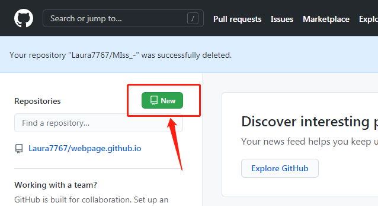

**如果是个人单页的话输入的仓库名要是username.github.io形式的**

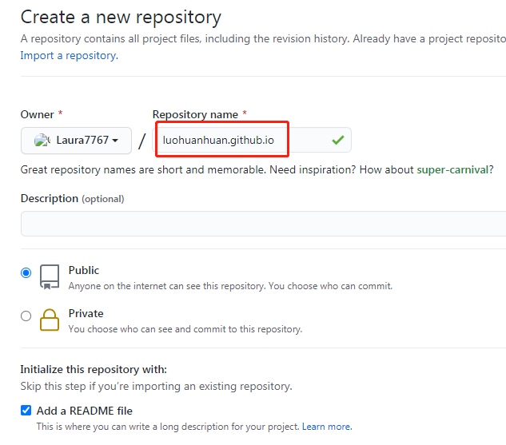

如下图仓库就建好了，不过只有readme.md文件


3.创建SSH-key，是用来决定你的本地电脑是不是可以修改这个仓库

进入[GitHub:SSH](https://help.github.com/articles/connecting-to-github-with-ssh/%E7%BD%91)站进行设置

4.创建项目后进入仓库-》setting，然后拉到最下面，有个GitHub Pages设置，这一步很重要，不设置的话网页打开没内容

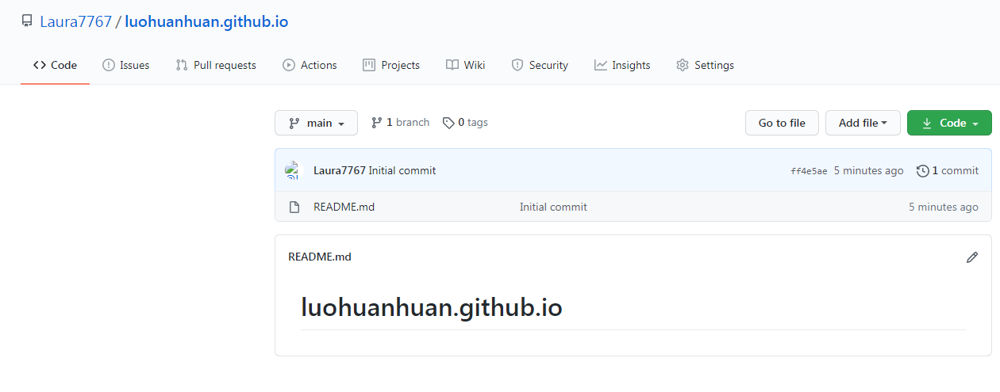

选择要使用的分支和路径，然后点击save保存，如下图说明设置成功了，可以访问所给的网页了

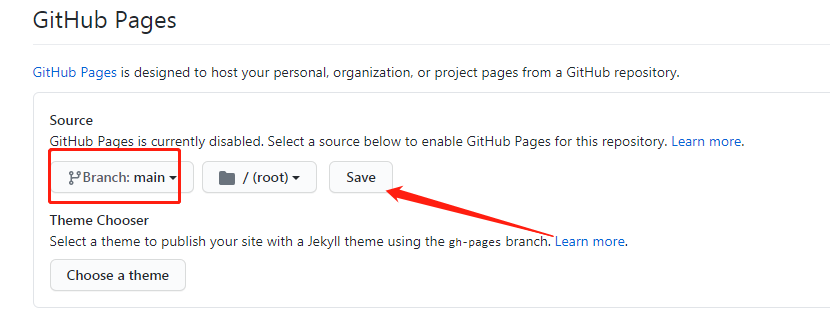

5.仓库创建以后可以上传代码

```
git clone 你的SSH地址 （下载你的reposity，这个地址可以用网页浏览的Clone-or-Download-use SSH按钮看到，比如说git@github.com:uername/reposity.git）
git pull （联系服务器，更新本地文件夹）
git add --all （写入本地的所有新文件）
git commit -am "随便说点啥" （在本地进行一次有记录地更新，包括本地所有文件的修改）
git push origin main （把本地的更新推送到服务器）
```

#### 博客及主题

主题文件目录

| 文件 / 目录                                          | 描述                                                         |
| ---------------------------------------------------- | ------------------------------------------------------------ |
| `_config.yml`                                        | 保存配置数据。很多配置选项都可以直接在命令行中进行设置，但是如果你把那些配置写在这儿，你就不用非要去记住那些命令了。 |
| `_drafts`                                            | drafts（草稿）是未发布的文章。这些文件的格式中都没有 `title.MARKUP` 数据。 |
| `_includes`                                          | 你可以加载这些包含部分到你的布局或者文章中以方便重用。可以用这个标签 `` 来把文件 `_includes/file.ext` 包含进来。 |
| `_layouts`                                           | layouts（布局）是包裹在文章外部的模板。布局可以在YAML头信息中根据不同文章进行选择。 这将在下一个部分进行介绍。标签 `{{ content }}` 可以将content插入页面中。 |
| `_posts`                                             | 这里放的就是你的文章了。文件格式很重要，必须要符合: `YEAR-MONTH-DAY-title.MARKUP`。 永久链接可以在文章中自己定制，但是数据和标记语言都是根据文件名来确定的。 |
| `_data`                                              | 格式化好的网站数据应放在这里。jekyll 的引擎会自动加载在该目录下所有的 yaml 文件（后缀是 `.yml`, `.yaml`, `.json` 或者 `.csv` ）。这些文件可以经由 ｀site.data｀ 访问。如果有一个 `members.yml` 文件在该目录下，你就可以通过 `site.data.members` 获取该文件的内容。 |
| `_site`                                              | 一旦 Jekyll 完成转换，就会将生成的页面放在这里（默认）。最好将这个目录放进你的 `.gitignore` 文件中。 |
| `.jekyll-metadata`                                   | 该文件帮助 Jekyll 跟踪哪些文件从上次建立站点开始到现在没有被修改，哪些文件需要在下一次站点建立时重新生成。该文件不会被包含在生成的站点中。将它加入到你的 `.gitignore` 文件可能是一个好注意。 |
| `index.html` and other HTML, Markdown, Textile files | 如果这些文件中包含YAML头信息部分，Jekyll 就会自动将它们进行转换。当然，其他的如 `.html`, `.markdown`, `.md`, 或者 `.textile` 等在你的站点根目录下或者不是以上提到的目录中的文件也会被转换。 |
| Other Files/Folders                                  | 其他一些未被提及的目录和文件如 `css` 还有 `images` 文件夹， `favicon.ico` 等文件都将被完全拷贝到生成的 site 中。这里有一些使用 Jekyll 的站点，如果你感兴趣就来看看吧。 |

## 6.vue中async和await的应用

#### 6.1 async的使用

async作为一个关键字放到函数前面，代表这个函数是一个异步函数，意思是说该函数的执行不会影响到后面代码的执行。

```
async function home () {
	return 'Hello!!!!!!!'
}
home();
console.log('我是异步函数后面的代码哦')
```

异步函数也是函数，按平时正常的函数调用使用。

打开控制台，上面的代码输出结果是：

```
我是异步函数后面的代码哦
>
```

异步函数没有返回结果，打印函数返回：

```
async function home () {
	return 'Hello!!!!!!!'
}
console.log(home())
console.log('我是异步函数后面的代码哦')
```

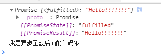

可以看到异步函数返回的是一个promise对象，如果要获取promise的返回值，用以下两种方法可以获取：

async函数内部的实现原理是：如果async函数只有一个返回值时，调用该函数时，内部会调用Promise.resolve()方法把它转化成一个promi对象作为返回值，但如果async函数内部抛出错误，内部会调用Promise.reject()返回一个promise对象。

使用then、catch方法

```
代码：
home().then(result => {
	console.log(result)
})

结果:
我是异步函数后面的代码哦
Hello!!!!!!!


or


home().catch(err => {
	console.log(err)
})
```

#### 6.2 async和await的使用

适用场景：项目需要调用很多接口，有时候后面的接口需要前一个接口的返回结果，如果前一个接口挂了，后面的接口也不需要调用了

平时写法：

```
methods: {
    // 获取所属地
    getLocation(phoneNum) {
        return axois.post('/location', {phoneNum});
    },
    // 根据属地获取充值面额列表
    getFaceList(province, city) {
        return axois.post('/location', {province, city});
    },
    // 采取链式的调用方法
    getFaceResult() {
      this.getLocation(this.phoneNum)
          .then(res => {
              if (res.status === 200 && res.data.success) {
                  let province = res.data.province;
                  let city = res.data.city;
                  this.getFaceList(province, city)
                      .then(res => {
                          if(res.status === 200 && res.data.success) {
                              this.faceList = res.data
                          }
                      })
              }
          }).catch(err => {
              console.log(err)
          })  
    }
}
```
async/await写法:

```
methods: {
    // 获取所属地
    getLocation(phoneNum) {
        return axois.post('/location', {phoneNum});
    },
    // 根据属地获取充值面额列表
    getFaceList(province, city) {
        return axois.post('/location', {province, city});
    },
    // 采取async await 方式调用
    async getFaceResult() {
      // 异常需要通过try catch补货  
      try {
          let location = await this.getLocation(this.phoneNum);
          // 程序会等待上一个请求完成才进行下一条的语句执行
          
          if (location.data.success) {
              let province = location.data.province;
              let city = location.data.city;
              let result = await this.getFaceList(province, city);
              if (result.data.success) {
                  this.faceList = result.data;
              }
          }
      } catch(err) {
          console.log(err);
      }
    }
}


or


function doubleAfter2seconds(num) {
    return new Promise((resolve, reject) => {
        setTimeout(() => {
            resolve(2 * num)
        }, 2000);
    } )
}
async function testResult() {
    let result = await doubleAfter2seconds(30);
    console.log(result);
}
testResult();

结果：2s后控制台显示 60
```


#### 6.3 注意事项

1. `async` 和 `await` 基于 promise 的。 使用 async 的函数将会始终返回一个 promise 对象
2. 在使用 `await` 的时候我们暂停了函数，而非整段代码
3. `async` 和 `await` 是非阻塞的
4. 仍然可以使用 `Promise` 例如 `Promise.all()`


## 7. echarts的使用

#### echarts的所有配置可参考[官网文档](https://echarts.apache.org/zh/index.html)查看。

##### 1. npm引入echarts

```
npm i v-charts echarts -S
```

##### 2. main.js中按需引入

```
import VeLine from 'v-charts/lib/line.common'
import VeRing from 'v-charts/lib/ring.common'
import 'echarts/lib/component/title'; // 如果要使用title属性一定要引入
Vue.component(VeLine.name, VeLine)
Vue.component(VeRing.name, VeRing)
```

##### 3. 页面中使用

###### 折线图

```
<ve-line :data="chartData" :settings="chartSettings" :extend="extend" :data-empty="dataEmpty"></ve-line>
import 'v-charts/lib/style.css'
  export default {
    data () {
      let that = this;
      let n = 0;
      this.chartSettings = {
        yAxisName: ['案件数量'],
        xAxisName: ['日期']
      }
      this.extend = {
        color: ['#40A1FC', '#40CCCA', '#53CB77', '#F9D248', '#F0617C', '#965FE1'],
        legend: {
          right: 50,
          icon: 'roundRect'
        },
        grid: {
          left: 0,
          right: 50,
          bottom: 20,
          top: 60,
          containLabel: true
        },
        xAxis: {
          nameLocation: 'end',
          nameTextStyle: {
            color: '#000',
            fontSize: 14,
            fontWeight: 'bold',
            padding: [0, 10, 0, 0]
          },
          axisLabel: {
            interval: function (index, value) {
              if (index == 0) {
                n = 0
              }
              let chartData = that.chartData.rows;
              let length = that.chartData.rows.length;
              let m = Math.floor(length / 7)
              if (chartData && length > 7) {
                if (((m * n + 1) == index + 1) || index + 1 == length) {
                  n++
                  return value;
                }
              } else {
                return value;
              }
            }
          }
        },
        yAxis: {
          nameTextStyle: {
            color: '#000',
            fontSize: 14,
            fontWeight: 'bold',
            padding: [0, 0, 10, 30]
          },
          minInterval: 1,
          splitLine: {
            lineStyle: {
              color: '#F1F1F1'
            }
          }
        }
      }
      return {
        legendData: [],
        chartData: {
          columns: ['dealDayNum', '新增案件', `组庭案件`, '完结案件'],
          rows: []
        },
        dataEmpty: false
      }
    },
    created () {
      this.getData()
    },
    methods: {
      getData () {
        this.chartData.rows = []
        this.dataEmpty = false
        this.$http({
          url: this.$http.adornUrl('/arbitration/casebaseinfo/statisticsInfo'),
          method: 'post',
          data: this.$http.adornParams({
            startTime: this.startTime,
            endTime: this.endTime
          })
        }).then(({data}) => {
          if (data && data.code === 0) {
            if (data.statisticsInfoVO) {
              let list1 = data.statisticsInfoVO.caseNumByDateList
              if (list1 && list1.length > 0) {
                for (let i = 0; i < list1.length; i++) {
                  this.chartData.rows.push({'新增案件': list1[i].addCaseNum, '组庭案件': list1[i].auditCaseNum, dealDayNum: list1[i].dealDate, '完结案件': list1[i].endcaseNum})
                }
              } else {
                this.dataEmpty = true
              }
            } else {
              this.dataEmpty = true
            }
          } else {
            this.$message.warning(data.msg)
          }
        })
      }
    }
  }
```

###### 环形图

```
<ve-ring ref="ringChart" :data="chartData" :extend="ringExtend" :title="ringTitle"></ve-ring>

import 'v-charts/lib/style.css'
export default {
  data () {
    let that = this;
    this.ringExtend = {
      // color: ['#38B46C','#E9A00F', '#BB69DB', '#F35C6A'],
      legend: {
        show: true,
        type: 'scroll',
        orient: 'vertical',
        icon: 'circle',
        left: '66%',
        top: '20%',
        formatter: function (name) {
          var total = 0;
          var target = 0;
          let data = that.chartData.rows;
          for (var i = 0; i < data.length; i++) {
            total += data[i].user;
            if (data[i].num == name) {
              target = data[i].user;
            }
          }
          let per = ''
          if (/(^[1-9]\d*$)/.test((target / total) * 100)) {
            per = (target / total) * 100
          } else {
            per = ((target / total) * 100).toFixed(2)
          }
          var str = '{a|' + name + '}' + '{b|' + per + '%' + '}' + '      ' + target
          return str
        },
        textStyle: {
          rich: {
            a: {
              width: 100
            },
            b: {
              width: 40,
              color: [0, 0, 0, 0.3]
            }
          }
        }
      },
      label: {
        formatter: function (params) {
          let per = params.percent + '%';
          let str = params.name + ' : ' + params.data.value + '(' + per + ')'
          return str
        }
      },
      series: {
        radius: ['35%', '55%'],
        center: ['30%', '50%'],
        itemStyle: {
          normal: {
            borderWidth: 3, // 图形数据间隔
            borderColor: '#fff'
          }
        }
      }
    }
    return {
      list: [
        { 'num': '周一', 'user': 1393 },
        { 'num': '周二', 'user': 3530 },
        { 'num': '周三', 'user': 2923 },
        { 'num': '周四', 'user': 1723 },
        { 'num': '周五', 'user': 3792 },
        { 'num': '周六', 'user': 4593 },
        { 'num': '周日', 'user': 4003 },
        { 'num': '周八', 'user': 3530 },
        { 'num': '周九', 'user': 2923 },
        { 'num': '周十', 'user': 1723 },
        { 'num': '周十一', 'user': 3792 },
        { 'num': '周十二', 'user': 4593 },
        { 'num': '周十三', 'user': 4003 },
        { 'num': '周十四', 'user': 1723 },
        { 'num': '周十五', 'user': 3792 },
        { 'num': '周十六', 'user': 4593 },
        { 'num': '周十七', 'user': 4003 },
        { 'num': '周十八', 'user': 4593 },
        { 'num': '周十九', 'user': 4003 },
        { 'num': '周二十 ', 'user': 4003 }
      ],
      chartData: {
        columns: ['num', 'user'],
        rows: []
      },
      ringTotal: 0,
      ringTitle: {}
    }
  },
  mounted () {
    this.ringTotal = 0
    for (let i = 0; i < this.list.length; i++) {
      this.ringTotal = this.ringTotal + this.list[i].user
      this.chartData.rows.push(this.list[i])
    }
    this.ringTitleEvent()
    let time = setInterval(() => {
      if (this.$refs.ringChart) {
        this.echart = this.$refs.ringChart.echarts
        this.setDispatch()
        clearInterval(time)
      }
    }, 50)
  },
  methods: {
    setDispatch () {
      this.echart.dispatchAction({
        type: 'highlight',
        seriesIndex: 0,
        dataIndex: 0
      });
    },
    ringTitleEvent () {
      this.ringTitle = {
        text: [
          '{name|案由类型}',
          '{value|' + parseFloat(this.ringTotal).toLocaleString() + '}'
        ].join('\n'),
        top: 'center',
        left: '29.4%',
        textAlign: 'center',
        textStyle: {
          rich: {
            value: {
              color: '#333',
              fontSize: 18,
              fontWeight: 'bold',
              lineHeight: 30,
              fontFamily: '"Helvetica Neue", Helvetica, "PingFang SC"'
            },
            name: {
              color: '#777',
              fontSize: 14,
              fontFamily: '"Helvetica Neue", Helvetica, "PingFang SC"'
            }
          }
        }
      }
    }
  }
}

```

注意：

legend多个添加滚动方法

main.js中添加

```
import 'echarts/lib/component/legendScroll';
```

成图如下：

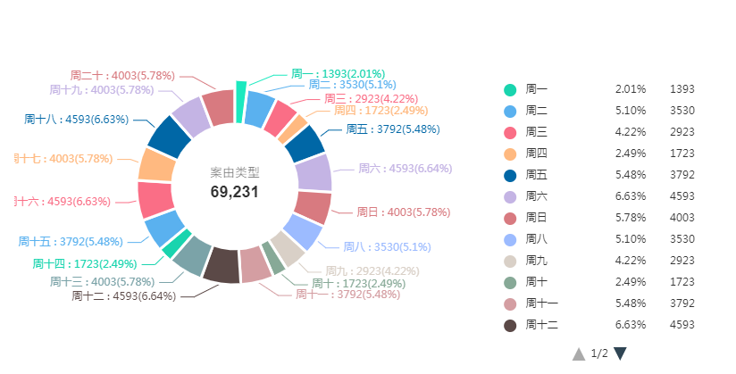

配置二：

```

  import 'v-charts/lib/style.css'
  export default {
    data () {
      let that = this;
      // 饼状图
      this.ringExtend = {
        color: ['#40A1FC', '#40CCCA', '#53CB77', '#F9D248', '#F0617C', '#965FE1', '#53CB77'],
        legend: {
          show: true,
          type: 'scroll',
          orient: 'vertical',
          icon: 'circle', // 'circle', 'rect', 'roundRect', 'triangle', 'diamond', 'pin', 'arrow', 'none'
          left: '42%',
          top: '20%',
          formatter: function (name) {
            var total = 0;
            var target;
            let data = that.ringData.rows;
            for (var i = 0; i < data.length; i++) {
              total += data[i].value;
              if (data[i].name == name) {
                target = data[i].value;
              }
            }
            let per = ''
            if (/(^[1-9]\d*$)/.test((target / total) * 100)) {
              per = (target / total) * 100
            } else {
              per = ((target / total) * 100).toFixed(2)
            }
            var str = '{a|' + name + '}' + '{b|' + per + '%' + '}' + '    ' + target + '件'
            return str
          },
          textStyle: {
            rich: {
              a: {
                width: 180
              },
              b: {
                width: 40,
                color: [0, 0, 0, 0.3]
              }
            }
          }
        },
        tooltip: {
          show: true
        },
        series: {
          radius: ['44%', '60%'],
          center: ['22%', '50%'],
          avoidLabelOverlap: false,
          label: {
            show: false,
            position: 'center',
            formatter: ['{b}', '{c}' + '件'].join('\n'),
            align: 'center',
            lineHeight: 20
          },
          emphasis: {
            label: {
              show: true,
              position: 'center',
              fontSize: '12',
              fontWeight: 'bold'
            }
          }
        },
        labelLine: {
          show: false
        }
      }
      return {
        caseNumList: [],
        causeList: [],
        opinion: [],
        timer: null,
        ringData: {
          columns: ['name', 'value'],
          rows: []
        },
        dataEmpty1: false,
        ringTotal: 0,
        ringTitle: {},
        legendData: [],
        dataEmpty: false
      }
    },
    created () {
      this.getData()
    },
    methods: {
      getData () {
        this.ringData.rows = []
        this.dataEmpty = false
        this.dataEmpty1 = false
        this.ringTitle = {}
        this.ringTotal = 0
        this.$http({
          url: this.$http.adornUrl('/arbitration/casebaseinfo/statisticsInfo'),
          method: 'post',
          data: this.$http.adornParams({
            startTime: this.startTime,
            endTime: this.endTime
          })
        }).then(({data}) => {
          if (data && data.code === 0) {
            if (data.statisticsInfoVO) {
              this.legendData = []
              let causeCaseNumList = data.statisticsInfoVO.causeCaseNumList
              this.dataEmpty1 = !causeCaseNumList || (causeCaseNumList && causeCaseNumList.length == 0)
              if (causeCaseNumList && causeCaseNumList.length > 0) {
                for (let i = 0; i < causeCaseNumList.length; i++) {
                  this.ringTotal = this.ringTotal + parseInt(causeCaseNumList[i].count)
                  let name = causeCaseNumList[i].causeName
                  this.ringData.rows.push({value: parseInt(causeCaseNumList[i].count), name: name})
                  this.legendData.push(causeCaseNumList[i].causeName)
                }
                // this.ringTitleEvent()
              } else {
                this.dataEmpty1 = true
              }
            } else {
              this.dataEmpty = true
              this.dataEmpty1 = true
            }
          } else {
            this.$message.warning(data.msg)
          }
        })
      }
    }
  }
```

成图如下：

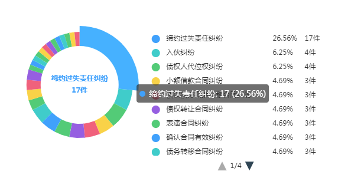

## 8. 编辑器tinymce及UEditor

vue项目中用到过两个编辑器，一个是tinymce和UEditor,tinymce兼容性不高。。IE11及以上版本才能使用，而UEditor兼容性高些。。。IE7.8都能用。。

tinymce的兼容性如下：

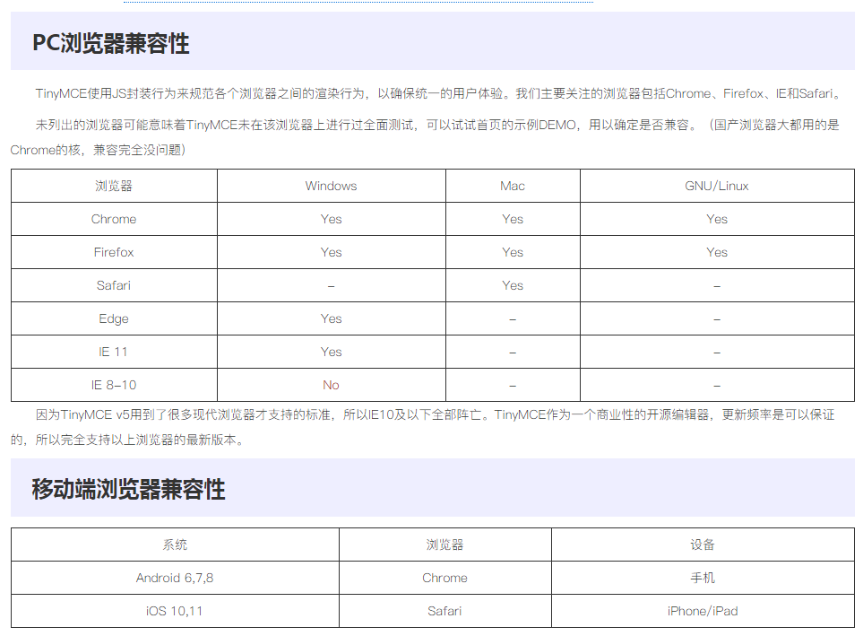

#### 1. tinymce的使用及配置

引入：

```
  import tinymce from 'tinymce/tinymce'
  import Editor from '@tinymce/tinymce-vue'
  import 'tinymce/themes/silver'
  import 'tinymce/icons/default/icons'
  import 'tinymce/plugins/paste'
  import 'tinymce/plugins/anchor'
  import 'tinymce/plugins/print'
  import 'tinymce/plugins/table'
  import 'tinymce/plugins/link'
  import 'tinymce/plugins/code'
  import 'tinymce/plugins/lists'
  import 'tinymce/plugins/contextmenu'
  import 'tinymce/plugins/wordcount'
  import 'tinymce/plugins/textcolor'


  components: {
	Editor
  },
  mounted () {
  	tinymce.init({})
  }
```

页面中使用：

```
<Editor id="tinymce" v-model="htmlContent" :init="init"></Editor>
```

配置：

```
data(){
    return{
		htmlContent: '',
        init: {
          language_url: window.SITE_CONFIG.cdnUrl + '/static/tinymce/langs/zh_CN.js', // 如果语言包不存在，指定一个语言包路径
          language: 'zh_CN', // 语言
          skin_url: window.SITE_CONFIG.cdnUrl + '/static/tinymce/skins/ui/oxide', // 如果主题不存在，指定一个主题路径
          content_css: window.SITE_CONFIG.cdnUrl + '/static/tinymce/skins/content/default/content.css',
          plugins: 'link lists wordcount code print textcolor table',
          toolbar: [
            'undo redo | fontsizeselect forecolor | bold italic underline strikethrough | alignleft aligncenter alignright alignjustify | bullist numlist outdent indent | table removeformat print | savebutton downloadbutton signbutton'
          ],
          height: '500px',
          branding: false, // 技术支持(Powered by Tiny || 由Tiny驱动)
          theme: 'silver', // 主题
          zIndex: 1101
        }
    }
}
```

插入标签：

```
insertLabel (file) {
	let value = '{' + file.filedName + '}'
	tinymce.execCommand('mceInsertContent', false, value)
}
```

操作：

```
// 聚焦
tinymce.editors[0].editorManager.get('tinymce').focus();
// 编辑和不可编辑操作
tinymce.get('tinymce').getBody().setAttribute('contenteditable', true);
```

#### 2. UEditor的使用和配置

引入：

```
<script src="./static/plugins/ueditor-1.4.3.3/ueditor.config.js"></script>
<script src="./static/plugins/ueditor-1.4.3.3/ueditor.all.min.js"></script>
<script src="./static/plugins/ueditor-1.4.3.3/lang/zh-cn/zh-cn.js"></script>
<!-- 如果要有自定义标注功能，引入以下文件 -->
<script src="./static/plugins/ueditor-1.4.3.3/customize/postilPlugin.js"></script>
<script src="./static/plugins/ueditor-1.4.3.3/customize/newPostilDialog.js"></script>
<script src="./static/plugins/ueditor-1.4.3.3/customize/displayPostil.js"></script>
```

文件见 .../img/ueditor-1.4.3.3

页面中使用：

```
<div id="ueditor-wrap">
	<script id="J_ueditorBox" class="ueditor-box" type="text/plain" style="width: 100%; height: 600px;"></script>
</div>
```

配置：

```
<script>
import ueditor from 'ueditor'
export default {
  data () {
    return {
      htmlContent: '',
      ue: null,
      config: {
        zIndex: 800,
        toolbars: [
          [ 'source', 'undo', 'redo', 'fontfamily', 'fontsize', 'forecolor', 'backcolor', 'bold', 'italic', 'underline', 'fontborder', 'strikethrough', 'superscript', 'subscript', '|',
            'justifyleft', 'justifycenter', 'justifyright', 'justifyjustify', '|',
            'insertorderedlist', 'insertunorderedlist',
            'customstyle', 'paragraph', '|',
            'rowspacingtop', 'rowspacingbottom', 'lineheight', 'indent', '|',
            'inserttable', 'removeformat', 'formatmatch', 'autotypeset', 'selectall', 'cleardoc', 'blockquote', 'pasteplain'
          ]
        ],
        autoHeightEnabled: false,
        elementPathEnabled: false,
        wordCountMsg: '当前已输入{#count}个字符&nbsp;&nbsp;',
        allowDivTransToP: false
      }
    }
  },
  beforeDestroy () {
    this.resetEditor()
  },
  created () {
    this.getUedito()
  },
  methods: {
    // 编辑器初始化
    getUeditor (html) {
      if (document.getElementById('ueditor-wrap') && !document.getElementById('ueditor-wrap').innerHTML) {
        document.getElementById('ueditor-wrap').innerHTML = `<script id="J_ueditorBox" class="ueditor-box" type="text/plain" style="width: 100%; height: 430px;"><\/script>`
      }
      this.$nextTick(() => {
        this.ue = ueditor.getEditor('J_ueditorBox', this.config)
        let that = this;
        this.ue.ready(function() {
          // that.ue.setContent(html);
          that.ue.setContent(html, false)
          // that.ue.execCommand('insertHtml', html)
        });
      })
    },
    resetEditor () {
      if (this.ue) {
        this.ue.destroy()
        this.ue = null
      }
      let arr = document.getElementById('J_ueditorBox')
      let id = document.getElementById('edui_fixedlayer')
      if (arr) {
        if (this.isIE() || this.isIE11()) {
          arr.removeNode(true);
        } else {
          arr.remove()
        }
      }
      if (id) {
        if (this.isIE() || this.isIE11()) {
          id.removeNode(true);
        } else {
          id.remove()
        }
      }
    },
    isIE () {
      if (!!window.ActiveXobject || 'ActiveXObject' in window) {
        return true;
      } else {
        return false;
      }
    },
    isIE11 () {
      if ((/Trident\/7\./).test(navigator.userAgent)) {
        return true;
      } else {
        return false;
      }
    }
  }
}
</script>
```

UEditor操作：

```
<!-- 获取内容 -->
    <div class="btn-wrap" style="margin-top: 30px">
        <el-button @click="getContent()">获得内容</el-button>
        <el-button @click="getAllHtml()">获得整个html的内容</el-button>
        <el-button @click="setContent()">写入内容</el-button>
        <el-button @click="setContent(true)">追加内容</el-button>
        <el-button @click="getContentTxt()">获得纯文本</el-button>
        <el-button @click="getPlainTxt()">获得带格式的纯文本</el-button>
        <el-button @click="hasContent()">判断是否有内容</el-button>
        <el-button @click="setFocus()">使编辑器获得焦点</el-button>
        <el-button @mousedown="isFocus(event)">编辑器是否获得焦点</el-button>
        <el-button @mousedown="setblur(event)" >编辑器失去焦点</el-button>

    </div>
    <div class="btn-wrap">
        <el-button @click="getText()">获得当前选中的文本</el-button>
        <el-button @click="insertHtml()">插入给定的内容</el-button>
        <el-button id="enable" @click="setEnabled()">可以编辑</el-button>
        <el-button @click="setDisabled()">不可编辑</el-button>
        <el-button @click="ue.setHide()">隐藏编辑器</el-button>
        <el-button @click="ue.setShow()">显示编辑器</el-button>
        <el-button @click="ue.setHeight(300)">设置高度为300默认关闭了自动长高</el-button>
    </div>

    <div class="btn-wrap" style="margin-bottom: 40px">
        <el-button @click="getLocalData()" >获取草稿箱内容</el-button>
        <el-button @click="clearLocalData()" >清空草稿箱</el-button>
    </div>
```

对应操作：

```
// 获得内容
      getContent () {
        this.dialogVisible = true
        this.ue.ready(() => {
          this.ueContent = this.ue.getContent()
        })
      },
      // 获得整个html的内容
      getAllHtml () {
        this.dialogVisible = true
        this.ue.ready(() => {
          this.ueContent = this.ue.getAllHtml()
        })
      },
      // 追加内容
      setContent (isAppendTo) {
        this.ue.ready(() => {
          this.ue.setContent('欢迎使用ueditor', isAppendTo)
        })
      },
      // 获取纯文本内容
      getContentTxt () {
        this.dialogVisible = true
        this.ue.ready(() => {
          this.ueContent = this.ue.getContentTxt()
        })
      },
      // 获取带格式的纯文本内容
      getPlainTxt () {
        this.dialogVisible = true
        this.ue.ready(() => {
          this.ueContent = this.ue.getPlainTxt()
        })
      },
      // 判断是否有内容
      hasContent () {
        this.dialogVisible = true
        this.ue.ready(() => {
          this.ueContent = this.ue.hasContents()
        })
      },
      // 使编辑器获取焦点
      setFocus () {
        this.ue.ready(() => {
          this.ue.focus()
        })
      },
      // 编辑器是否获得焦点
      isFocus (e) {
        this.dialogVisible = true
        this.ue.ready(() => {
          console.log(this.ue.isFocus())
          this.ueContent = this.ue.isFocus()
          this.ue.dom.domUtils.preventDefault(e)
        })
      },
      // 失去焦点
      setblur (e) {
        this.ue.ready(() => {
          this.ue.blur()
          this.ue.dom.domUtils.preventDefault(e)
        })
      },
      // 获取当前选中的文本
      getText () {
        // 当你点击按钮时编辑区域已经失去了焦点，如果直接用getText将不会得到内容，所以要在选回来，然后取得内容
        this.dialogVisible = true
        this.ue.ready(() => {
          var range = this.ue.selection.getRange();
          range.select();
          this.ueContent = this.ue.selection.getText();
        })
      },
      // 插入给定的内容
      insertHtml () {
        var value = prompt('插入html代码', '');
        this.ue.execCommand('insertHtml', value)
      },
      setDisabled () {
        this.ue.setDisabled('fullscreen');
        // this.disableBtn('enable');
      },
      setEnabled () {
        this.ue.setEnabled();
        // this.enableBtn();
      },
      disableBtn (str) {
        this.ue.ready(() => {
          var range = this.ue.selection.getRange();
          range.select();
          this.ueContent = this.ue.selection.getText();
          console.log(this.ue)
        })
        var div = document.getElementById('btns');
        var btns = this.ue.dom.domUtils.getElementsByTagName(div, 'button');
        for (var i = 0; i < btns.lenght; i++) {
          let btn = btns[i]
          if (btn.id == str) {
            this.ue.dom.domUtils.removeAttributes(btn, ['disabled']);
          } else {
            btn.setAttribute('disabled', 'true');
          }
        }
      },
      enableBtn () {
        var div = document.getElementById('btns');
        console.log(this.ue)
        console.log(this.ue.dom)
        var btns = this.ue.dom.domUtils.getElementsByTagName(div, 'button');
        for (var i = 0; i < btns.lenght; i++) {
          let btn = btns[i]
          this.ue.dom.domUtils.removeAttributes(btn, ['disabled']);
        }
      },
      getLocalData () {
        this.dialogVisible = true
        this.ue.ready(() => {
          this.ueContent = this.ue.execCommand('getlocaldata')
        })
      },
      clearLocalData () {
        this.ue.execCommand('clearlocaldata');
      }
```

## 9. vue分片上传

实现分片上传、秒传及断点续传的功能，使用vue-simple-uploader插件实现该功能

vue-simple-uploader是基于simple-uploader.js封装的vue上传插件。它的优点包括且不限于以下几种：

- 支持文件、多文件、文件夹上传；支持拖拽文件、文件夹上传
- 可暂停、继续上传
- 错误处理
- 支持“秒传”，通过文件判断服务端是否已存在从而实现“秒传”
- 分块上传
- 支持进度、预估剩余时间、出错自动重试、重传等操作

可以参考下面两个文档查看参数、函数等：

[vue-simple-uploader](https://github.com/Laura7767/vue-uploader/blob/main/README_zh-CN.md)

[simple-uploader](https://github.com/Laura7767/uploader/blob/main/README_zh-CN.md)

或参考文档：

[vue封装文件分片上传](https://www.cnblogs.com/xiahj/p/vue-simple-uploader.html)

#### 使用

```
npm install vue-simple-uploader --save
npm install spark-md5 --save
```

在main.js中引用：

```
import uploader from 'vue-simple-uploader'
Vue.use(uploader)
```

在项目文件中的引用：

```
<template>
	<div>
		<el-button type="text" size="small" @click="importEvidence(scope.row.id)">导入</el-button>

  		<el-dialog
    title = "上传证据"
    :visible.sync="evidenceDialogVisible"
    width="20%"
    :before-close="handleClose1">
<uploader :options="options" class="uploader-example" :autoStart="false" ref="uploader"
                    @file-added="fileAdded" @file-progress="onFileProgress" @file-success="onFileSuccess" @file-error="onFileError" @file-removed="onFileRemoved">
              <uploader-unsupport></uploader-unsupport>
              <uploader-drop>
              <uploader-btn ref="btn">选择证据包</uploader-btn>
            </uploader-drop>
            <uploader-list style="margin-top: 10px;" ref="uploader_list" id="uploader_list" v-loading="loading" element-loading-text="证据包添加中，请稍候..."></uploader-list>
            <el-button style="margin-top: 15px;" type="primary" @click="uploadAll" v-if="showFlag && this.caseFlag" :disabled="isDisabled">全部上传</el-button>
          </uploader>
		</el-dialog>
	</div>
</template>
```

script中使用：

```
<script>
import SparkMD5 from 'spark-md5'
export default {
  data () {
    return {
      caseFlag: false,
      // 导入证据包
      evidenceDialogVisible: false,
      evidenceParams: {},
      // 导入案件信息
      caseParams: {},
      caseName: '',
      caseFile: '',
      options: {
        // 可通过 https://github.com/simple-uploader/Uploader/tree/develop/samples/Node.js 示例启动服务
        target: this.$http.adornUrl('/sys/upload/chunkUpload'), // 目标上传 URL
        chunkSize: 5 * 1024 * 1024,   // 分块大小2M
        fileParameterName: 'file', // 上传文件时文件的参数名，默认file
        // maxChunkRetries: 3,  // 最大自动失败重试上传次数
        testChunks: true,  // 是否开启服务器分片校验
        simultaneousUploads: 50,
        // 服务器分片校验函数，秒传及断点续传基础
        checkChunkUploadedByResponse: function (chunk, message) {
          let objMessage = JSON.parse(message);
          if (objMessage.flag && !objMessage.flag) {
            return true;
          } else {
            return false
          }
          // let arr = []
          // if (objMessage.chunks && objMessage.chunks.length > 0) {
          //   for (let i = 0; i < objMessage.chunks.length; i++) {
          //     arr.push(objMessage.chunks[i].chunkNumber)
          //   }
          // }
          // return (arr || []).indexOf(chunk.offset + 1) >= 0
        },
        processResponse: function (response, cb) {
          let res = JSON.parse(response);
          if (res.code != 200) {
            Message.warning(res.msg)
            let flag = false
            cb(flag, response)
          } else {
            cb(null, response)
          }
        }
      },
      // isUploaded_zip: false,
      // notUploadedChunkNumbers_zip: [],
      // fileList: [],
      fileParams: {},
      packageParams: {
        identifier: '',
        fileName: '',
        chunks: '',
        totalSize: '',
        type: ''
      },
      caseIds: [],
      uploadFlag: false,
      curId: '',
      btnFlag: false,
      packageFileInfoList: [],
      suitFlag: false,
      showFlag: false,
      num: 0,
      isDisabled: false,
      fileNum: 0,
      loading: false,
      fileLength: 0,
      curNum: 0
    }
  },
  inject: ['reload'],
  computed: {
    uploader () {
      return this.$refs.uploader;
    }
  },
  methods: {
    // 批量上传
    uploadAll () {
      let btn = document.getElementsByClassName('uploader-file-resume')
      let _len = document.getElementsByClassName('uploader-file-resume').length;
      if (_len === this.num) {
        this.$message.warning('暂无可上传的文件！')
        return false;
      }
      for (let i = 0; i < _len; i++) {
        if (i != 0) {
          let timer = setTimeout(() => {
            btn[i].click()
            clearTimeout(timer)
          }, 50)
        } else {
          btn[i].click()
        }
      }
      this.isDisabled = true
    },
    // 上传单个文件
    fileAdded (file, event) {
      this.btnFlag = true
      // console.log(this.$refs.uploader, this.$refs.uploader_list)
      this.$nextTick(() => {
        this.fileLength = this.uploader.fileList.length
        if (!this.caseFlag && this.uploader.fileList.length > 1) {
          file.cancel()
          this.$message.warning('只能上传单文件！')
          return false
        }
      })
      if (/zip/gi.test(file.fileType) || file.name.indexOf('.zip') > -1 || /rar/gi.test(file.fileType) || file.name.indexOf('.rar') > -1 || /7z/gi.test(file.fileType) || file.name.indexOf('.7z') > -1) {
        this.loading = true
        this.computeMD5(file);  // 生成MD5
      } else {
        this.$message({message: '您上传的文件类型不正确，请上传.zip、.rar或.7z格式文件！', type: 'warning'});
        file.cancel();
        file.removeFile(file)
        return false;
      }
    },
    // 计算MD5值
    computeMD5 (file) {
      var that = this;
      // that.isUploaded_zip = false; // 这个文件是否已经上传成功过
      // that.notUploadedChunkNumbers_zip = []; // 未成功的chunkNumber
      var fileReader = new FileReader();
      let time = new Date().getTime();
      let md5 = '';
      file.pause();
      fileReader.readAsArrayBuffer(file.file);
      fileReader.onload = function (e) {
        if (file.size != e.target.result.byteLength) {
          that.$message.warning('文件读取失败!')
          return false;
        }
        md5 = SparkMD5.ArrayBuffer.hash(e.target.result, false) + time + file.id;
        // console.log(`MD5计算完毕：${file.id} ${file.name} MD5：${md5} 用时：${new Date().getTime() - time} ms`);
        file.uniqueIdentifier = md5;
        // 添加额外的参数
        // this.uploader.opts.query = {
        //   ...that.params
        // }
        that.$nextTick(() => {
          that.showFlag = true
          that.isDisabled = false
          that.fileNum += 1
          that.curNum += 1
          if (that.curNum == that.fileLength) {
            that.loading = false
          }
        })
      };
      fileReader.onerror = function () {
        that.$message.warning('异步读取文件出错了!')
        return false;
      };
    },
    // 文件移除
    onFileRemoved (file) {
      this.fileNum -= 1
      this.curNum -= 1
      if (this.curNum == this.num) {
        this.btnFlag = false
      }
      if (this.uploader.fileList.length == 0) {
        this.showFlag = false
      }
    },
    // 上传进度
    onFileProgress (rootFile, file, chunk) {
      // console.log(`上传中 ${file.name}，chunk：${chunk.startByte / 1024 / 1024} ~ ${chunk.endByte / 1024 / 1024}`)
    },
    // 上传成功
    onFileSuccess (rootFile, file, response, chunk) { // 内部自动调用
      let res = JSON.parse(response);
      if (res.code === 200) { //
        // if (this.isUploaded_zip) { // 不要也可，file.cancel()后就不会onFileSuccess()
        //   this.$message({ message: '该文件已经上传成功过了，不能再上传了哦。', type: 'success' });
        // } else {
        let type = ''
        if (file.name.toUpperCase().indexOf('.RAR') > -1) {
          type = '.rar'
        } else if (file.name.toUpperCase().indexOf('.ZIP') > -1 || file.fileType == 'application/zip') {
          type = 'application/zip'
        } else if (file.name.toUpperCase().indexOf('.7Z') > -1) {
          type = '.7z'
        }
        this.packageParams.identifier = file.uniqueIdentifier;
        this.packageParams.fileName = file.name
        this.packageParams.chunks = file.chunks.length
        this.packageParams.totalSize = file.size
        this.packageParams.type = type
        this.$http({
          url: this.$http.adornUrl('/sys/upload/mergeFile'),
          method: 'post',
          timeout: 300000,
          params: this.$http.adornParams(this.packageParams)
        }).then(({data}) => {
          this.btnFlag = false
          if (data && data.code === 200) {
            this.num += 1
            this.$message({ message: this.num + '个证据包上传成功！', type: 'success' });
            this.fileNum -= 1
            this.uploadFlag = true
            if (this.curNum == this.num) {
              this.btnFlag = false
            }
            if (!this.caseFlag) {
              this.fileParams = data.packageFile
            } else {
              this.packageFileInfoList.push(data.packageFile)
            }
          } else {
            file.cancel()
            this.$message({
              type: 'warning',
              showClose: true,
              duration: 20000,
              message: file.name + data.msg + '，请重新上传!'
            });
            if (!this.caseFlag) {
              this.btnFlag = true
            }
          }
        })
        // }
      } else {
        this.$message({ message: res.msg, type: 'warning' });
      }
    },
    onFileError (rootFile, file, response, chunk) {
      let res = JSON.parse(response);
      this.$message({
        message: res.msg,
        type: 'warning'
      })
      return false;
    },
    // 导入证据包
    importEvidence (id) {
      this.evidenceDialogVisible = true
      this.num = 0
      this.showFlag = false
      this.$nextTick(() => {
        window.uploader = this.$refs.uploader.uploader
        var time = setTimeout(() => {
          let uploadBtn = document.getElementsByClassName('uploader-btn')
          let btn = uploadBtn[0]
          this.$refs.uploader.uploader.assignBrowse(btn, false, true, {})
          clearTimeout(time)
        }, 100)
      })
    },
    submitEvidenceForm () {
      if (this.caseFlag && !this.caseName) {
        this.$message.warning('请导入案件信息！')
        return false
      }
      if (this.fileNum != 0) {
        this.$message.warning('证据包还有部分正在导入中，请稍候！')
        return false
      }
      this.btnFlag = true
      if (this.caseFlag) {
        let loading = Loading.service({
          lock: true,
          text: '案件导入中，请稍候...',
          background: 'rgba(256, 256, 256, 0.7)'
        });
        let param = new FormData(); // 创建form对象
        param.append('file', this.caseFile); // 通过append向form对象添加数据
        ....接口
      }
    },
    // 导入案件信息
    getCaseFuc () {
      this.caseFlag = true
      this.evidenceDialogVisible = true
      this.num = 0
      this.curNum = 0
      this.showFlag = false
      this.caseName = ''
      this.caseFile = ''
      this.$nextTick(() => {
        window.uploader = this.$refs.uploader.uploader
        var time = setTimeout(() => {
          let uploadBtn = document.getElementsByClassName('uploader-btn')
          let btn = uploadBtn[0]
          this.$refs.uploader.uploader.assignBrowse(btn, false, false, {})
          clearTimeout(time)
        }, 100)
      })
    },
    uploadCase () {
      document.getElementById('uploadCase').click()
    },
    getCase (e) {
      let file = e.target.files[0]
      // console.log(this.caseFile)
      // let param = new FormData(); // 创建form对象
      // param.append('file', this.caseFile); // 通过append向form对象添加数据
      // param.append('fileName', this.caseFile.name);
      if (file) {
        // console.log(this.caseFile.size)
        let type = file.name.indexOf('.xls') > -1 || file.name.indexOf('.xlsx') > -1
        if (type) {
          if (file.size < 12 * 1024 * 1024) {
            // this.$http.post(this.$http.adornUrl('/bankcase/caseinfo/batchImportCaseInfo'), param, {headers: {'Content-Type': 'multipart/form-data'}}).then(
            // ({data}) => {
            //   if (data && data.code === 200) {
            //     this.$message.success(data.msg)
            this.caseName = file.name
            this.caseFile = e.target.files[0];
            //   } else {
            //     this.$message.warning(data.msg)
            //   }
            document.getElementById('uploadCase').value = ''
            // })
          } else {
            this.$message.warning('上传文件大小不能超过12M，请重新上传')
            return false
          }
        } else {
          this.$message.warning('上传文件只能是.xls或.xlsx文件！')
          return false
        }
      }
    },
    handleClose1 () {
      this.caseName = ''
      this.caseFile = ''
      this.fileNum = 0
      this.curNum = 0
      this.fileLength = 0
      this.loading = false
      this.packageFileInfoList = []
      this.isDisabled = false
      if (this.$refs.uploader.fileList.length > 0) {
        this.reload()
        this.$refs.uploader = null
      }
    }
  }
}
</script>
```


## 10. api cloud使用

#### 1. 应用项目代码本地下载（已知）

1.按照`说明`下载[TortoiseSVN](https://tortoisesvn.net/)，利用SVN工具checkout出代码

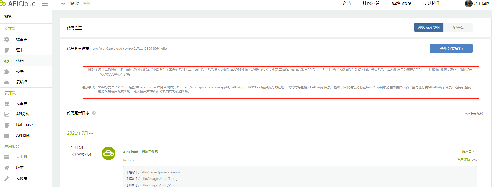

2. 代码下载以后，在本地新建一个本地文件夹，右击鼠标会出现SVN checkout选项，点击导出文件，上面的地址就是APICloud显示的地址

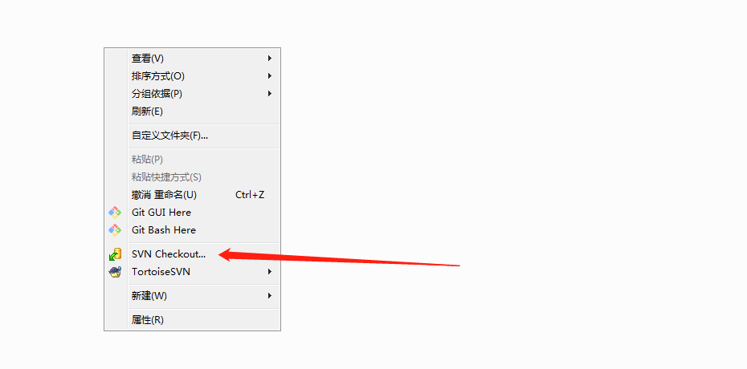

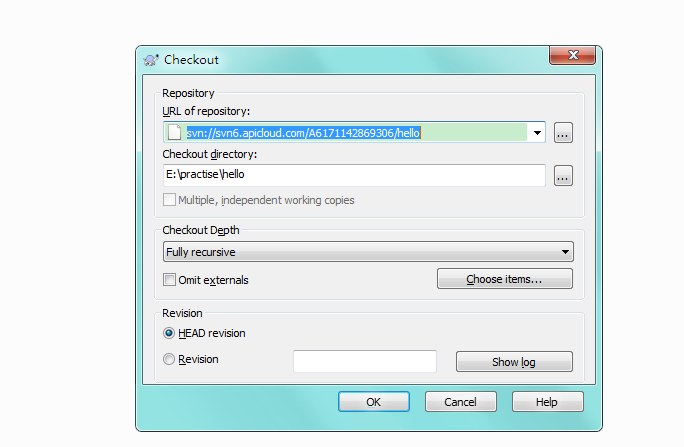

3. 点击确认后，会弹出弹窗让输入username和password,username是APICloud的注册账号邮箱地址，密码是项目的分支密码，确认后代码就下载到了本地

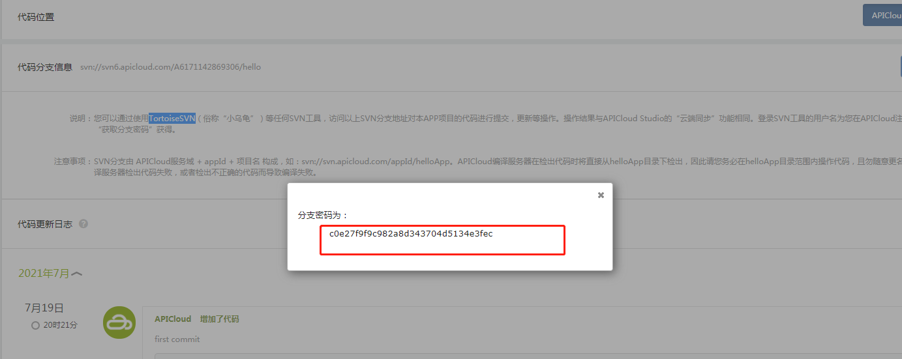

#### 2. 代码编辑及真机调试

1. 先[下载studio3](https://www.apicloud.com/studio3#downloadBtn)和[下载Apploader](https://docs.apicloud.com/Download/download)

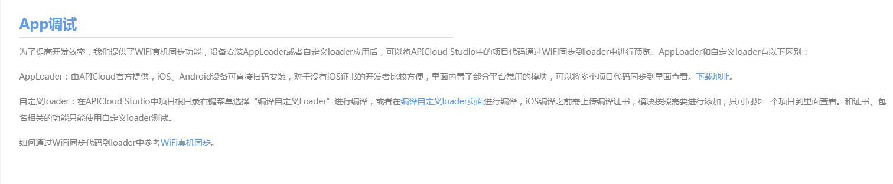

2. IOS按照指示下载并安装成功后，点击会显示企业开发者工具信任提示，需要到设置—》通用—》设备管理里面选择安装的软件信任，之后APP就能成功打开了。

3. 在studios3里面选择“项目”导入项目，要保证手机和电脑在同一个局域网下，点击左侧的“真机同步”，点击按照WIFI寻找新设备，会出现一个弹窗二维码，用手机Apploader扫描连接项目，能看到预览

#### 3. APICloud云服务3.0—database使用

按照[使用文档](https://docs.apicloud.com/Cloud-API/sentosa)说明操作创建，写demo的时候用的是网站给的，但是页面网络一直连不上，刚开始是服务没有开启，模块上面的两个点都是红的，后来点开随便一个model，点进里面点击【发布到测试环境】，数据库是重启了，但是网络还是连不上，后来才发现是因为要点击此下拉框点击【全部发布到测试环境】，这样数据能正常连接。

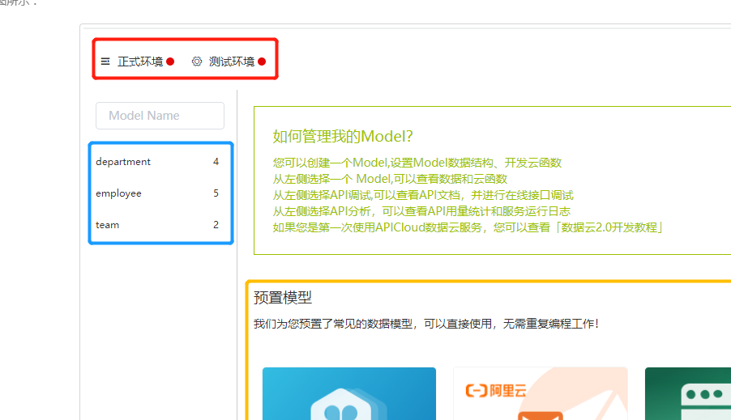


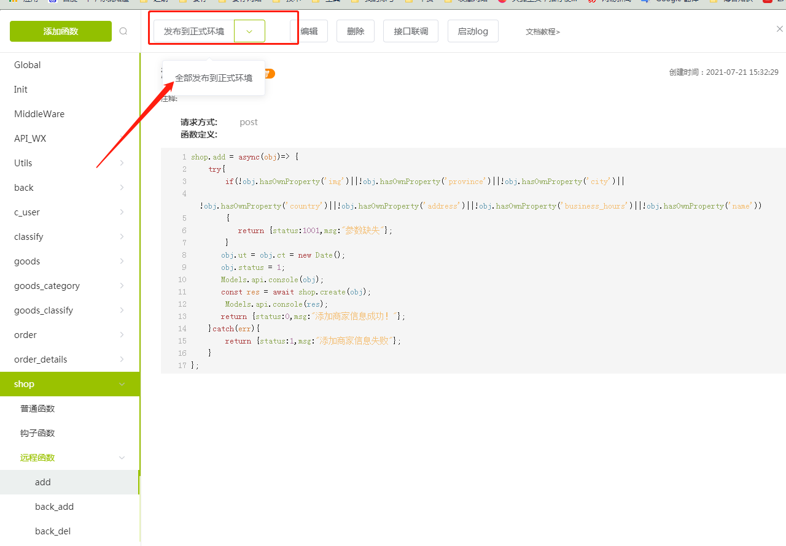


发布成功后，随便点击【接口联调接口】有swagger页面，服务就是重启成功了,打开的地址是https://a6171214999865-dev.apicloud-saas.com/api/

项目使用也是按照这个地址配置的

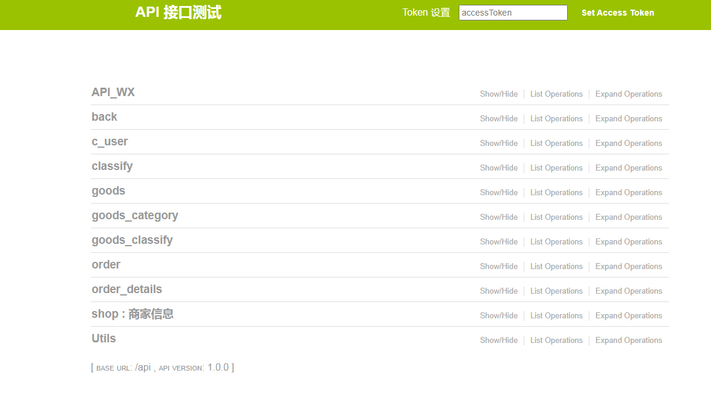

## 11. taro运行

已有的项目运行的时候，要看下tarojs项目，本地安装对应的项目，要不然会报错。

安装依赖：

```
npm install
```

编译运行的话可以参考[Taro文档](https://taro-docs.jd.com/taro/docs/GETTING-STARTED)

自己运行的话用的是微信开发工具，所以用的是

```
npm run dev:weapp
```

刚开始的时候一直报错。。，错误信息是：

```
TypeError: ctx.modifyWebpackChain is not a function
```

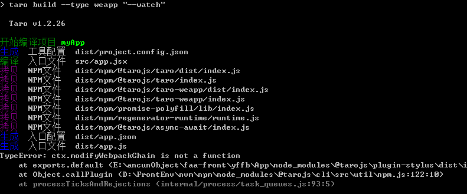

安装了好多版本，后来发现是.json里面的tarojs版本和本地安装的版本不兼容的问题，所以重新安装了@tarojs/cli,升级到和配置文件一样的版本，编译后正确是

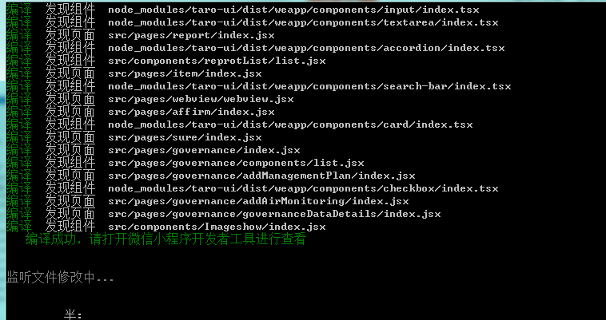

编译成功后的dist文件目录是：

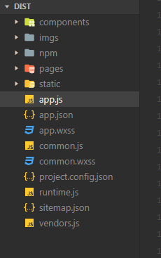

之前编译错误的文件目录一直是只有npm，app.js，app.json等文件，没有imgs、pages、static、components等文件。

编译成功后，将dist文件导入微信开发工具中，运行还是报错：

```
Uncaught TypeError: Cannot delete property 'WeixinJSBridge' of #<Window>

Uncaught TypeError: Cannot read property 'on' of undefined

Unhandled promise rejection TypeError: WebAssembly Instantiation: Argument 0 must be a buffer source or a WebAssembly.Module object at Object.t.wasm_initialize (VM72 WAService.js:2)
```

解决问题也很简单，点击右上角的详情，切换本地设置--》》调试基础库的版本，知道正常为止。

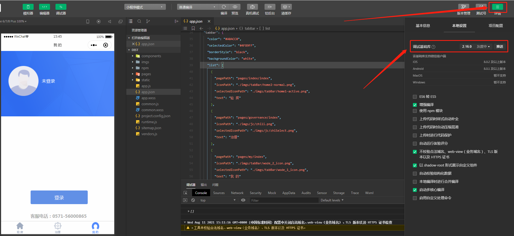

编译成功后，改变源代码，终端代码会自动重新编译，在微信开发工具中能看到效果了。

## 12. uni-app使用

request二次封装：

```
// 对uni.request二次封装
const baseUrl = 'https://www.imovietrailer.com/superhero/'
export const request = {
	post: function({api, method = "POST", params, header = {'content-type':'application/x-www-form-urlencoded'}}) {
		return new Promise((resolve, reject) => {
			let defaultParams = {
				// qq: 由于是使用的别人的接口 此处不公开展示
			}
			let data = Object.assign(defaultParams,params)
			let url = baseUrl + api
			uni.request({
				url,
				data,
				method,
				header,
				success: (res) => {
					if(res.data.status === 200) {
						resolve(res.data.data)
					} else {
						reject(res.data.msg)
					}
				}
			})
		})
	}
}
```

在main.js中引用：

```
import { request} from './common/js/api.js'
```

项目中使用：

```
this.$http.post({api, params: {type}}).then(res => {
				console.log(res)
				if(type === 'superhero') {
					this.hotList = res
				} else {
					this.trailerList = res
				}
			})
```


## 附录一：vue.js 

### 1.1 vue环境安装

#### 第一种方法 直接引入

在Vue.js的官网上直接下载[vue.js](https://cn.vuejs.org/),并在<script>标签中引用。->  <script src = ../vue.js> </script>  

提示

开发环境不要使用最小压缩版，不然会没有错误提示和警告


#### 第二种方法 **CDN方法**

- BootCDN（国内） :[ https://cdn.bootcss.com/vue/2.2.2/vue.min.js ](https://cdn.bootcss.com/vue/2.2.2/vue.min.js)， （国内不稳定）           

- unpkg：<https://unpkg.com/vue/dist/vue.js>, 会保持和 npm 发布的最新的版本一致。（推荐使用）

- cdnjs : <https://cdnjs.cloudflare.com/ajax/libs/vue/2.1.8/vue.min.js>，如（<script src="https://cdnjs.cloudflare.com/ajax/libs/vue/2.1.8/vue.min.js"></script>）

  

#### 第三种方法 **NPM方法**

1. 安装<a href="_blank" href="https://github.com/coreybutler/nvm-windows/releases">node.js</a>

   安装完成后可用cmd命令行查看自己的安装信息

   ```
   cmd命令行输入： node -v
   			  npm -v
   
   如果安装成功会显示所安装的对应的版本信息
   ```

2. 安装淘宝镜像

   因为国内npm安装依赖会很慢，所以建议安装淘宝镜像

   在cmd中输入：    npm install -g cnpm --registry= https://registry.npm.taobao.org 

   

3. 安装vue-cli脚手架

   淘宝镜像安装成功后，在cmd中输入： npm install -g vue -cli    来安装vue-cli脚手架  -g是全局安装的意思

   

4. 创建vue.js项目

   然后输入：vue init webpack 文件名 开始创建项目

   之后会关于项目有些设置

   

   

   Install vue-router?建议选择yes

   use ESlint to line your code?建议yes，虽然中间会容易因为格式报错，但是有助于养成良好的规范代码的习惯

   

5. 安装相关的依赖

   你可以在cmd中输入： cd 文件名   进入你要创建vue项目的目录中 如cd sell

   输入 npm install，回车，安装相关依赖

   回到项目文件夹，会发现项目结构里，多了一个node_modules文件夹（该文件里的内容就是之前安装的依赖） 

   

6. 运行项目

   在cmd中输入npm run dev

   在浏览器中输入localhost:8080查看页面，如果运行成功，会出现如下页面

   

### 


## 附录二：mock.js

### 2.1 mock的概念

mock是一个模拟数据生成器，旨在帮助前端独立于后端进行开发，帮助编写单元测试。mock有如下功能：

- 根据数据模板生成模板数据
- 模拟ajax请求，生成请求数据
- 基于html模板生成模拟数据

### 2.2 mock安装

```命令行
因为我是和Vue结合使用，所以直接运行命令行安装   
npm install mockjs --save-dev
安装之后.检查package.json是否有mockjs版本号，如有，说明安装成功。
如果安装很慢，可以换成淘宝镜像源来安装
cnpm install mockjs --save-dev 
```

~~~mock调用
//使用mock
var Mock = require('mockjs');
var data = Mock.mock({
    ...
})
~~~


### 2.3 基本语法

mock的语法规范包含两层规范

- 数据模板 （DTD）
- 数据占位符 （DPD）

#### 2.3.1 数据模板DTD

语法规则：‘ name|rule’:value

- name：属性名
- rule：属性规则
- value：属性值

rule可选，有7中：

1. ‘name|mix-max’:value
2. 'name|count':value
3. 'name|mix-max.dmix-dmax':value
4. 'name|min-max.dcount':value
5. 'name|count.dmin-dmax':value
6. 'name|count.dcount':value
7. 'name|+step':value

生成规则需要根据属性值的类型确定  属性值可以含有@占位符还可以指定最终值的初始值和类型 。

##### 1.属性值是String

~~~属性值string语法
var data = Mock.mock({
    'name1|1-3':'a',       //重复生成1到3个a
    'name2|2':'b'          //生成bb
})
~~~

##### 2.属性值是Number

~~~属性值Number语法
var data = Mock.mock({
    'name1|+1':4,         //生成4，如果循环每次加1
    'name2|1-7':2,        //生成1到7之间的一个数字
    'name3|1-4.5-8':1     //生成一个小数，整数部分1到4，小数部分5到8位
})
~~~


### mockjs的使用

#### 1. mockjs随机模拟数据的使用

我们是用mockjs来模拟接口数据的，所以模拟数据之前要配置好vue和axios环境


1. 安装并配置好vue运行环境后，安装axios

   ``` npm install axios --save``` 

2. axios安装成功后，运行命令行安装mockjs

   ```命令行
   npm install mockjs --save-dev
   安装之后.检查package.json是否有mockjs版本号，如有，说明安装成功。
   如果安装很慢，可以换成淘宝镜像源来安装
   cnpm install mockjs --save-dev 
   ```
3. 安装成功后和main.js同级文件中新建一个mock.js文件，在这个文件中我们可以定义要返回的模拟数据。数据的模拟规则可以参考官网的例子来写。如下图所示：


4. 数据规则定义以后要在入口文件mainjs中引入，如下图所示：

   

5. 在页面中用axios方法调用模拟的数据，如下图所示：

   

   6. 得到的数据如下图所示，跟后台接口返回数据一样


### 2. 本地数据使用

1. 可以根据页面的设计看需要哪些数据或者询问后端人员，然后本地自己写一个json格式的返回数据，如下图所示:

   

2. vue 2.0版本的话在webpack.dev.conf.js 配置文件中添加如下的代码，如果vue低版本的话在dev-server.js中添加：

```
    const express = require('express');
  	const app = express(); // 创建express应用程序，express是Node.js Web应用程序开发框架

	const appData = require('../data.json'); // 加载本地创建的json文件
	const seller = appData.seller; // 获取本地数据对应的文件
	const goods = appData.goods;
	const ratings = appData.ratings;

	const apiRoutes = express.Router(); // 获取express路由实例

    apiRoutes.get('/seller', function (req, res) {
      res.json({
        errno: 0,
        data: seller
      });
    });

    apiRoutes.get('/goods', function (req, res) {
      res.json({
        errno: 0,
        data: goods
      });
    });

    apiRoutes.get('/ratings', function (req, res) {
      res.json({
        errno: 0,
        data: ratings
      });
    });

    app.use('/api', apiRoutes);
```

3.  在下面的devServer中添加 如下代码：

```
   before (app) {
     app.get('/api/seller', function(req, res) {
       res.json({
         errno: 0,
         data: seller
       })
     });
     app.get('/api/goods', function(req, res) {
       res.json({
         errno: 0,
         data: goods
       })
     });
     app.get('/api/ratings', function(req, res) {
       res.json({
         errno: 0,
         data: ratings
       })
     });
   },
```

4. 运行npm run dev运行vue，然后访问/api/seller看是否能正确读取数据。如下图：

   

数据我是用google 的jsonview插件格式化处理过的

5. 在页面中调用接口内容
6. 页面展示结果：


## 附录三：javascript高级程序设计

#### 3.1 函数表达式

1. `arguments.callee`是一个指向正在执行的函数的指针，可以用它来实现对函数的递归调用

  ~~~ 注意
  在严格模式下，不能通过脚本访问arguments.callee
  ~~~

2. 在匿名函数中定义的任何变量，都会在执行结束时被销毁 

3. 匿名函数中，为避免变量在函数中随处都可以访问到而模仿的块级作用域，叫`私有作用域 `

~~~例子
(function(){
 //这里是块级作用域
})(); 
~~~

4. 任何在函数中定义的变量都是`私有变量`，包括函数的`参数`、`局部变量`以及函数内部定义的`其它函数`。
5. 有权访问私有变量和私有函数的公有方法称为`特权方法 `

~~~ 实例
function MyObject(){
 //私有变量
 var privateVariable = 10;
 //私有函数
 function privateFunction(){
 return false;
 }
 //特权方法
 this.publicMethod = function (){
 privateVariable++;
 return privateFunction();
 };
} 
/**
*	在创建 MyObject 的实例后，除了使用 publicMethod()这一个途径外，没有任何办法可以直接访问			privateVariable 和 privateFunction()。
**/
~~~

#### 3.2 DOM的回流和重绘

render tree(渲染树)变化会引起回流，回流一定会引起重绘，但是重绘不一定会引起回流

重绘：color, backgroundColor, visibility


#### 3.3 DOM事件流

DOM2级事件规定的事件流包括三个阶段：事件捕获阶段、处于目标阶段和事件冒泡阶段。

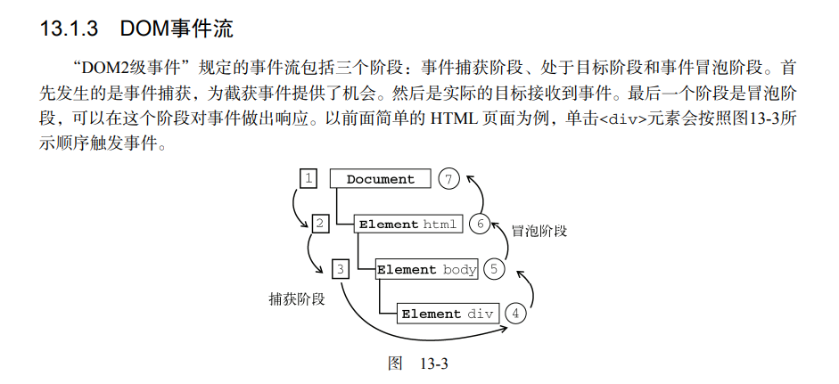


DOM2级事件处理程序

用于处理指定和删除事件处理程序的操作：addEventListener()和removeEventListener()

```
var btn = document.getElementById("myBtn");
btn.addEventListener("click", function () {
	alert(this.id)
}, false)
```

最后这个布尔值参数如果是true，表示在捕获阶段调用事件处理程序；如果是false,表示在冒泡阶段调用事件处理程序。

## 附录四：vuejs-pagination

#### 4.1 安装

查看官网有三种安装方式：

1.npm安装

~~~ 命令
npm install vuejs-paginate --save
~~~

然后在main.js中引入：

ES5格式：

~~~命令代码
var Paginate = require('vuejs-paginate')
Vue.component('paginate', Paginate)
~~~

ES6格式：

~~~ 命令代码
import Paginate from 'vuejs-paginate'
Vue.component('paginate', Paginate)
~~~

2.CDN

~~~ 命令代码
<!-- use the latest release -->
<script src="https://unpkg.com/vuejs-paginate@latest"></script>
<!-- or use the specify version -->
<script src="https://unpkg.com/vuejs-paginate@0.9.0"></script>
~~~

然后在页面中引入

~~~代码
Vue.component('paginate', VuejsPaginate)
~~~

#### 4.2属性

官网上全部是英文，好多不懂是什么意思，就自己用例子一个属性一个属性的尝试

| 属性名字           | 类型   | 描述   |
| ------------------ | ------ | ----------------------------------------|
| **page-count** | `Number` | 总页数。**必须项** |
| **page-range** | `Number` | 显示页面范围，即当前页面左右页码显示范围。**默认：3**（`tips:最好是奇数，前后对称，否则前面会比后面多一页`） |
| **margin-pages** | `Number` |边距的显示个数|
| **prev-text ** | `String` |上一页的文本内容。**默认：Prev**|
| **next-text ** | `String` |上一页的文本内容。**默认：Next**|
| **break-view-text ** | `String` |省略页码文本内容。**默认：...**|
| **force-page ** | `Number` |被覆盖的选定页面的页码 。（`不太懂`）|
| **click-handler ** | `Function ` |点击跳转页码时的回调函数，一般是把当前页码当做参数。|
| **container-class ** | `String` |该布局插件的类名。|
| **page-class ** | `String` |每个页码的li标签的类名。|
| **page-link-class ** | `String` |每个页码的a标签的类名。|
| **prev-class ** | `String` |前一页按钮的li标签的类名。|
| **prev-link-class ** | `String` |前一页按钮的a标签的类名。|
| **next-class ** | `String` |下一页按钮的li标签的类名。|
| **next-link-class ** | `String` |下一页按钮的a标签的类名。|


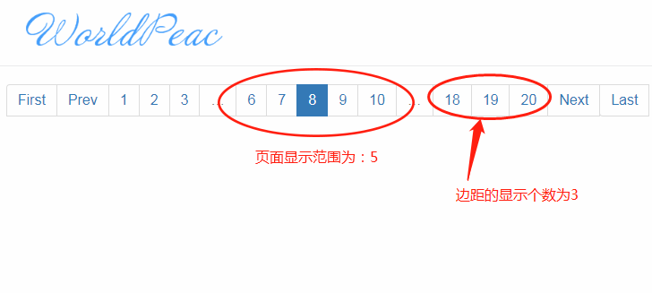


## 
